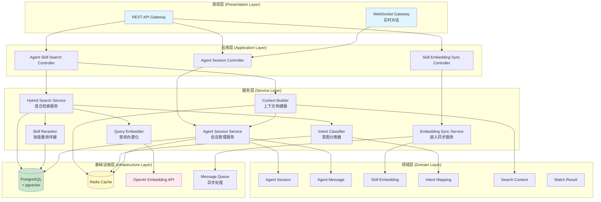
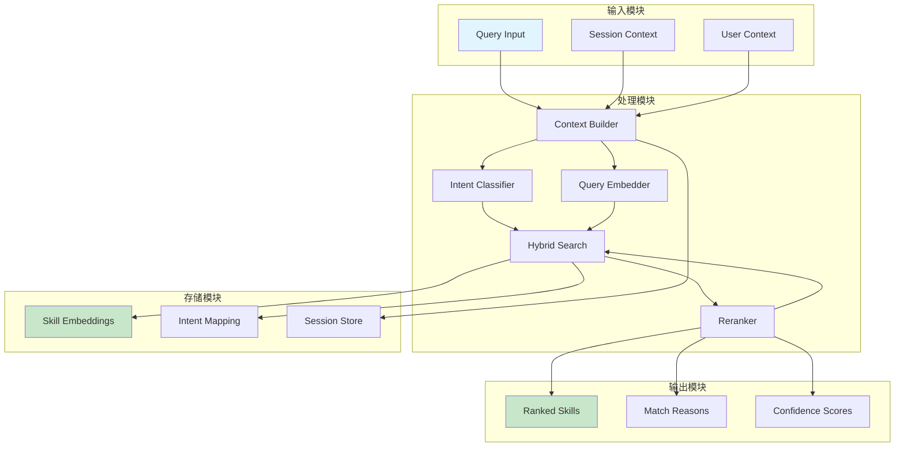
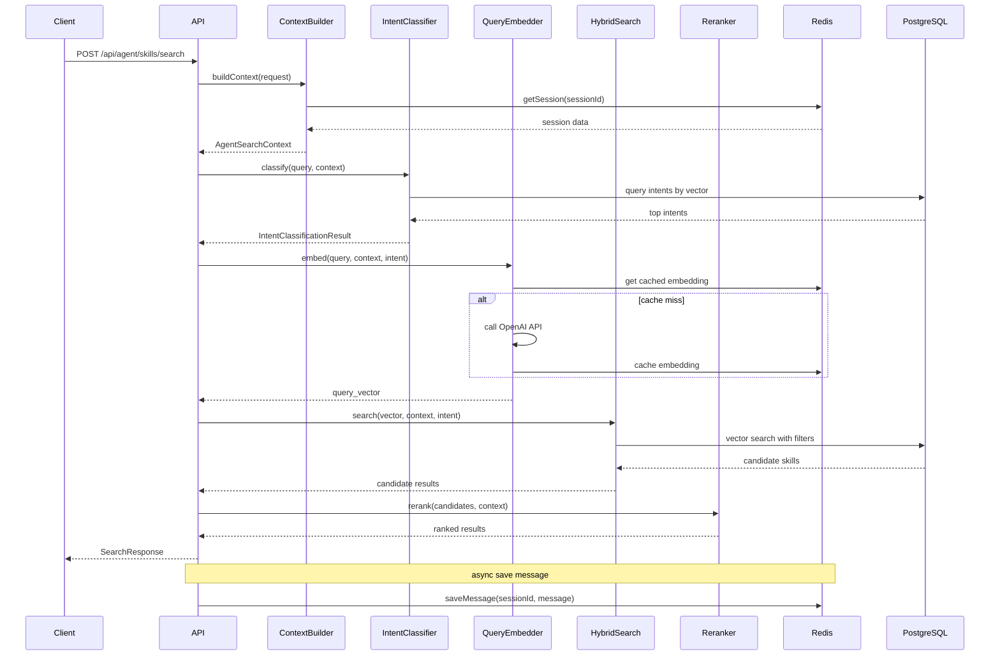
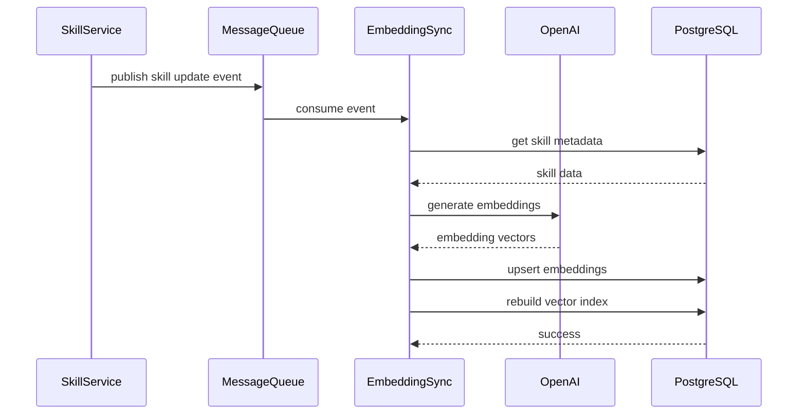
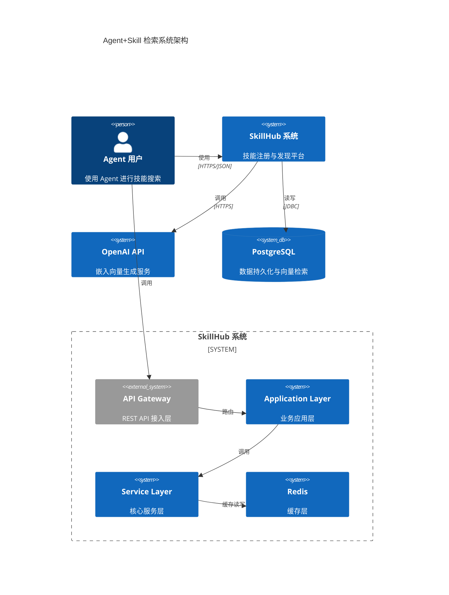
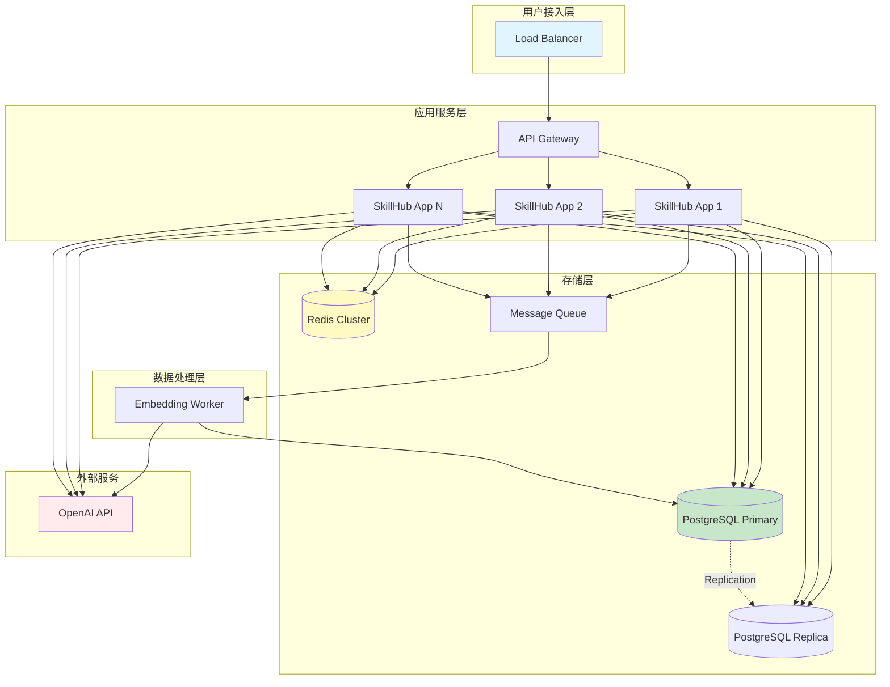
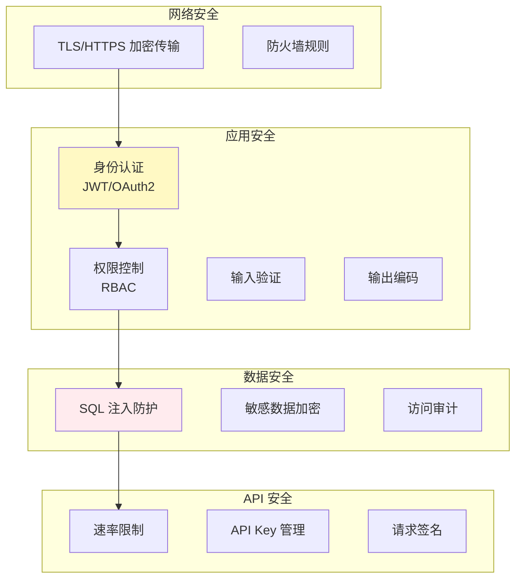
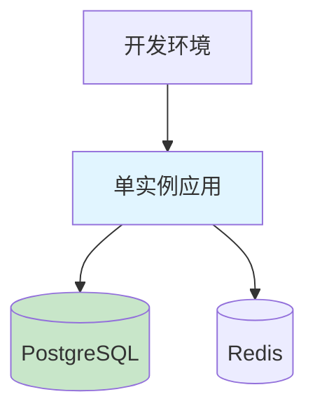
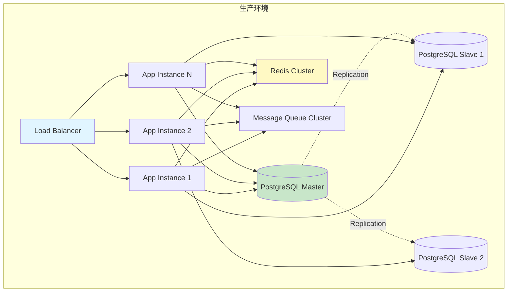

# Agent+Skill 检索系统架构设计

## 1. 系统概述

### 1.1 设计目标

构建一个基于 PostgreSQL + pgvector 的智能技能检索系统，通过意图识别、多轮对话上下文、场景描述、用户角色、标签和元数据等多维度信息，为 Agent 精准匹配适合的 Skills。

### 1.2 核心能力

- **语义理解**：基于向量嵌入的语义相似度检索
- **意图识别**：识别用户查询的真实意图类别
- **上下文感知**：结合多轮对话历史，理解用户当前需求
- **场景适配**：根据使用场景和用户角色推荐技能
- **多维度融合**：综合向量、意图、标签、流行度、评分等多维度评分

## 2. 系统分层架构

### 2.1 整体分层



### 2.2 分层职责

| 层级 | 职责 | 核心组件 |
|------|------|----------|
| 表现层 | 暴露 API，处理请求响应 | REST API、WebSocket |
| 应用层 | 编排业务流程，处理应用逻辑 | Controller、DTO |
| 服务层 | 核心业务逻辑实现 | 各种 Service |
| 领域层 | 领域模型和业务规则 | Entity、Domain Object |
| 基础设施层 | 数据持久化、外部服务调用 | 数据库、缓存、API |

## 3. 核心模块设计

### 3.1 模块关系图



### 3.2 模块详细设计

#### 3.2.1 Context Builder（上下文构建器）

**职责**：收集并整合所有上下文信息

**输入**：
- 查询文本
- Session ID
- 用户 ID
- 场景描述（可选）
- 用户角色（可选）
- 元数据（可选）

**输出**：`AgentSearchContext`

**核心逻辑**：
1. 从缓存/数据库加载会话历史
2. 提取最近 N 轮对话作为上下文
3. 整合用户角色和场景信息
4. 构建统一的上下文对象

#### 3.2.2 Intent Classifier（意图分类器）

**职责**：识别用户查询的意图类型

**实现方式**：基于向量相似度的分类

**流程**：
1. 将查询文本转换为向量
2. 与预定义的意图嵌入计算余弦相似度
3. 返回 Top-N 意图及置信度

**输出**：`IntentClassificationResult`

#### 3.2.3 Query Embedder（查询向量化）

**职责**：将综合查询上下文转换为向量

**向量融合公式**：
```
query_vector = normalize(
    w1 * embed(query_text) +
    w2 * embed(conversation_context) +
    w3 * embed(scenario_description) +
    w4 * embed(user_role) +
    w5 * intent_embedding
)
```

**权重配置**：
- w1 (查询文本): 0.4
- w2 (对话上下文): 0.2
- w3 (场景描述): 0.15
- w4 (用户角色): 0.1
- w5 (意图): 0.15

#### 3.2.4 Hybrid Search Service（混合检索服务）

**职责**：执行多维度检索，综合多种检索策略

**检索维度**：
1. 向量检索：pgvector 语义相似度
2. 意图过滤：基于意图类别过滤
3. 标签匹配：精确匹配用户指定标签
4. 权限过滤：根据用户角色过滤可见技能

**检索策略**：先向量检索获得候选集，再逐步过滤

#### 3.2.5 Skill Reranker（技能重排序器）

**职责**：对检索结果进行多维度重排序

**评分公式**：
```
final_score = α * vector_similarity
            + β * intent_match_score
            + γ * tag_match_score
            + δ * popularity_score
            + ε * rating_score
```

**权重配置**：
- α (向量相似度): 0.4
- β (意图匹配): 0.25
- γ (标签匹配): 0.2
- δ (流行度): 0.1
- ε (评分): 0.05

#### 3.2.6 Agent Session Service（会话管理服务）

**职责**：管理 Agent 对话会话的生命周期

**核心功能**：
- 创建新会话
- 追加对话消息
- 获取会话历史
- 会话过期管理
- 异步持久化

## 4. 数据流设计

### 4.1 主检索流程



### 4.2 技能向量同步流程



## 5. 架构图

### 5.1 系统架构图



### 5.2 容器架构图



## 6. 可扩展性设计

### 6.1 水平扩展

| 组件 | 扩展方式 | 说明 |
|------|----------|------|
| 应用服务 | 多实例部署 | 通过负载均衡分发请求 |
| 数据库 | 读写分离 | 主库写入，从库读取 |
| 缓存 | 集群模式 | Redis Cluster 分片存储 |
| 向量索引 | 分区表 | 按技能类别分区 |

### 6.2 垂直扩展

| 资源 | 优化方向 | 说明 |
|------|----------|------|
| CPU | 异步处理 | 嵌入生成异步化 |
| 内存 | 缓存优化 | 热数据缓存 |
| 网络 | 批量请求 | 减少 API 调用次数 |
| 存储 | 索引优化 | ivfflat 参数调优 |

### 6.3 扩展点

1. **嵌入提供者接口**：支持切换不同的嵌入模型
2. **意图分类器接口**：支持自定义意图分类逻辑
3. **重排序策略接口**：支持业务特定的排序规则
4. **过滤器插件接口**：支持添加自定义过滤逻辑

## 7. 可靠性设计

### 7.1 故障处理策略

| 故障场景 | 处理策略 | 降级方案 |
|----------|----------|----------|
| OpenAI API 调用失败 | 重试 3 次，指数退避 | 使用本地哈希向量 |
| 向量索引不可用 | 记录告警，使用全文搜索 | 基于关键词检索 |
| 意图识别失败 | 使用默认意图 "general" | 无降级 |
| 数据库连接失败 | 切换到只读副本 | 返回缓存结果 |
| Redis 不可用 | 直接查询数据库 | 稍微增加响应时间 |
| 消息队列不可用 | 同步处理嵌入 | 稍微增加发布时间 |

### 7.2 数据一致性

| 场景 | 策略 |
|------|------|
| 会话消息保存 | 写后读一致性 |
| 嵌入向量更新 | 最终一致性 |
| 缓存更新 | Write-Through |
| 搜索索引更新 | 异步重建 |

### 7.3 容灾设计

- 数据库定期备份（每日全量 + 每小时增量）
- Redis AOF 持久化 + RDB 快照
- 应用服务多可用区部署
- 关键接口重试机制

## 8. 性能设计

### 8.1 性能目标

| 指标 | 目标值 |
|------|--------|
| P95 查询响应时间 | < 500ms |
| P99 查询响应时间 | < 1000ms |
| 并发 QPS | > 100 |
| 支持 Agent 数量 | > 1000 |
| 单会话消息数 | > 1000 |
| 技能库规模 | > 10000 |

### 8.2 性能优化策略

1. **缓存策略**
   - 活跃会话：Redis 缓存，TTL 1 小时
   - 意图嵌入：Redis 缓存，永久
   - 技能嵌入：PostgreSQL 存储，版本更新时失效
   - 查询结果：Redis 缓存，TTL 5 分钟

2. **数据库优化**
   - 向量索引：ivfflat，lists = sqrt(行数)
   - 查询优化：限制候选集大小
   - 连接池：合理配置连接池大小

3. **异步处理**
   - 嵌入生成：异步处理
   - 会话消息保存：异步持久化
   - 指标收集：异步上报

4. **批量操作**
   - 批量向量生成
   - 批量数据库写入
   - 批量缓存更新

## 9. 安全设计

### 9.1 安全层次



### 9.2 安全措施

| 安全领域 | 措施 |
|----------|------|
| 认证 | JWT Token，有效期 1 小时 |
| 授权 | 基于角色的访问控制 (RBAC) |
| 加密 | HTTPS 传输，数据库字段加密 |
| 审计 | 记录关键操作日志 |
| 限流 | 用户级别 + IP 级别限流 |
| 输入验证 | 所有输入参数校验 |

## 10. 监控与可观测性

### 10.1 监控指标

| 类别 | 指标 |
|------|------|
| 业务 | 搜索请求量、Top-10 准确率、意图识别准确率 |
| 性能 | 响应时间 P50/P95/P99、QPS、错误率 |
| 系统 | CPU 使用率、内存使用率、磁盘 I/O |
| 数据库 | 连接数、查询耗时、慢查询数 |
| 缓存 | 命中率、内存使用、键数量 |

### 10.2 日志策略

| 日志类型 | 级别 | 内容 |
|----------|------|------|
| 访问日志 | INFO | 请求/响应摘要 |
| 业务日志 | INFO | 关键业务操作 |
| 错误日志 | ERROR | 异常堆栈 |
| 审计日志 | WARN | 敏感操作 |

### 10.3 告警规则

| 场景 | 阈值 | 级别 |
|------|------|------|
| P95 响应时间 | > 1000ms | WARNING |
| 错误率 | > 1% | WARNING |
| 错误率 | > 5% | CRITICAL |
| 数据库连接数 | > 80% | WARNING |
| OpenAI API 失败率 | > 10% | CRITICAL |

## 11. 部署架构

### 11.1 开发环境



### 11.2 生产环境



### 11.3 部署策略

| 环境 | 实例数 | 数据库 | 缓存 |
|------|--------|--------|------|
| 开发 | 1 | 单实例 | 单实例 |
| 测试 | 2 | 1主1从 | 单实例 |
| 预发 | 2 | 1主2从 | 哨兵模式 |
| 生产 | 3+ | 1主N从 | 集群模式 |

## 12. 总结

本架构设计遵循以下原则：

1. **分层清晰**：表现层、应用层、服务层、领域层、基础设施层职责分明
2. **高内聚低耦合**：各模块职责单一，依赖关系清晰
3. **可扩展**：通过接口抽象支持多种扩展方式
4. **高可用**：多实例部署、读写分离、故障降级
5. **高性能**：多层缓存、异步处理、批量操作
6. **安全可靠**：多层次安全防护、完善的监控告警

该架构能够满足 Agent+Skill 检索系统的核心需求，为后续实现提供清晰的指导。
