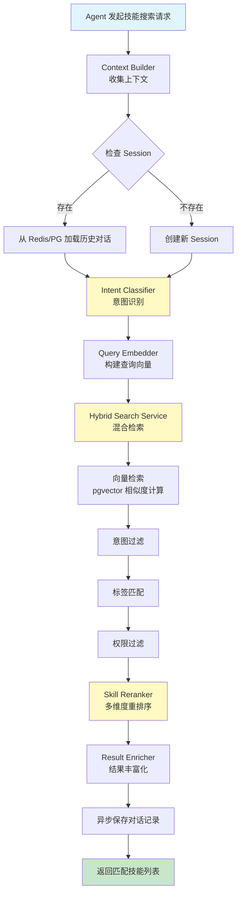
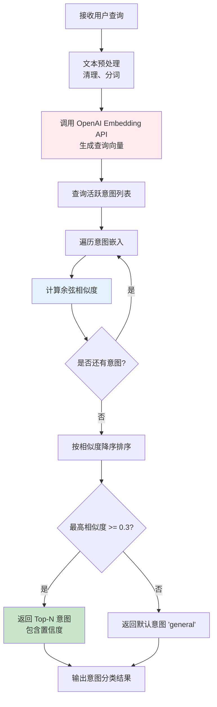
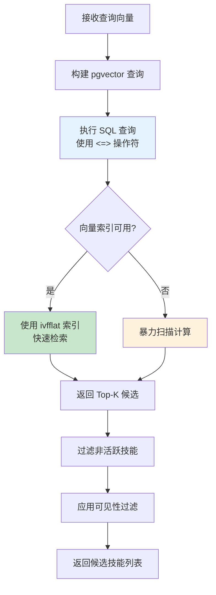
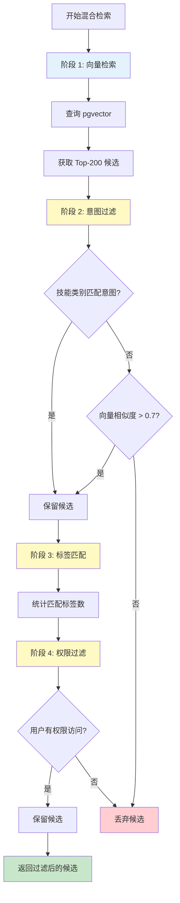
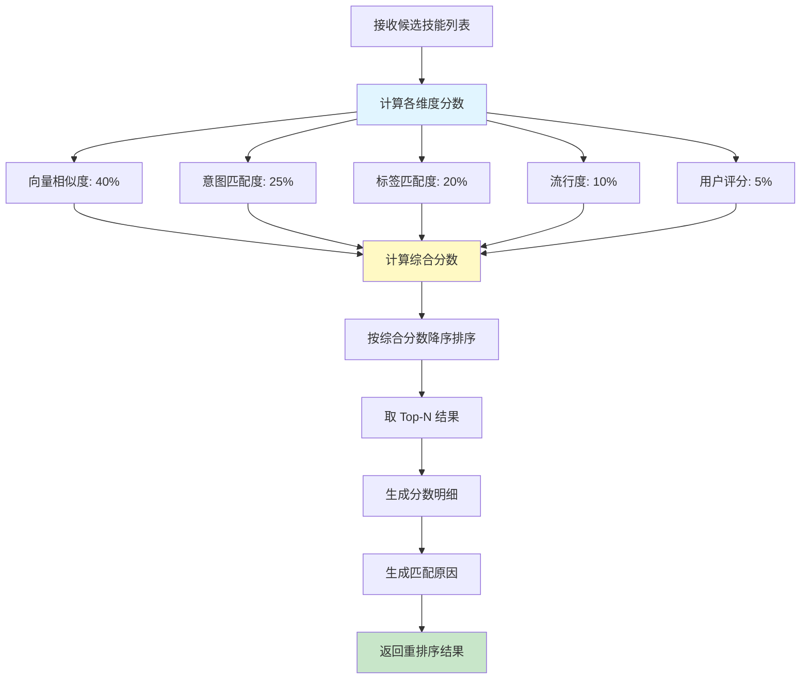
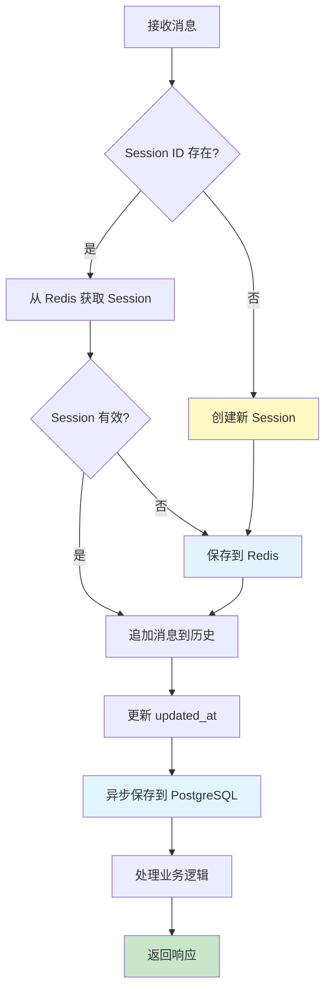
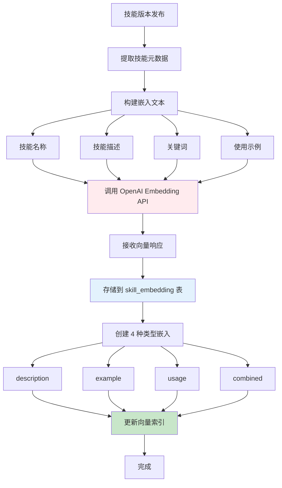
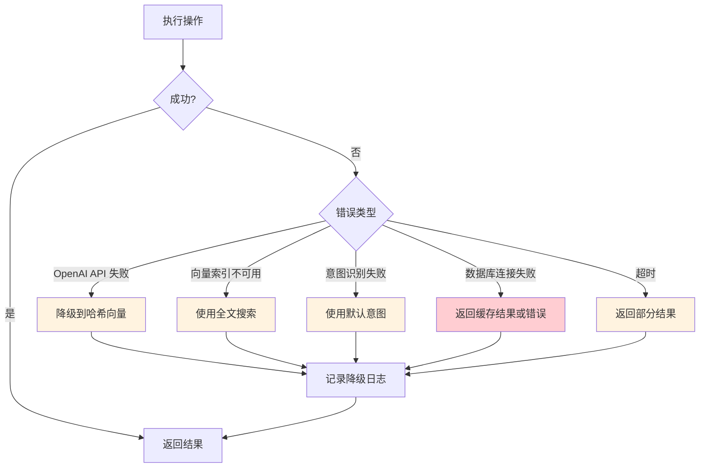
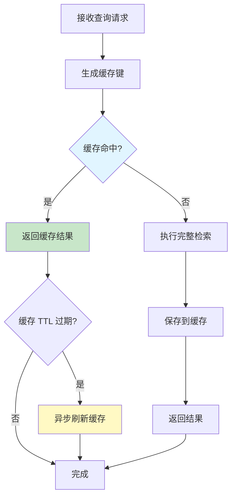
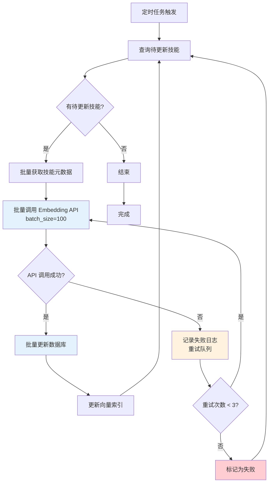

# Agent Skills 智能检索系统 - 流程图

## 1. 主检索流程

```mermaid
flowchart TD
    A[Agent 发起技能搜索请求] --> B[Context Builder<br/>收集上下文]
    B --> C{检查 Session}
    C -->|存在| D[从 Redis/PG 加载历史对话]
    C -->|不存在| E[创建新 Session]
    D --> F[Intent Classifier<br/>意图识别]
    E --> F
    F --> G[Query Embedder<br/>构建查询向量]
    G --> H[Hybrid Search Service<br/>混合检索]
    H --> I[向量检索<br/>pgvector 相似度计算]
    I --> J[意图过滤]
    J --> K[标签匹配]
    K --> L[权限过滤]
    L --> M[Skill Reranker<br/>多维度重排序]
    M --> N[Result Enricher<br/>结果丰富化]
    N --> O[异步保存对话记录]
    O --> P[返回匹配技能列表]

    style A fill:#e1f5ff
    style P fill:#c8e6c9
    style F fill:#fff9c4
    style H fill:#fff9c4
    style M fill:#fff9c4
```

## 2. 意图识别流程

```mermaid
flowchart TD
    A[接收用户查询] --> B[文本预处理<br/>清理、分词]
    B --> C[调用 OpenAI Embedding API<br/>生成查询向量]
    C --> D[查询活跃意图列表]
    D --> E[遍历意图嵌入]
    E --> F[计算余弦相似度]
    F --> G{是否还有意图?}
    G -->|是| E
    G -->|否| H[按相似度降序排序]
    H --> I{最高相似度 >= 0.3?}
    I -->|是| J[返回 Top-N 意图<br/>包含置信度]
    I -->|否| K[返回默认意图 'general']
    J --> L[输出意图分类结果]
    K --> L

    style C fill:#ffebee
    style F fill:#e3f2fd
    style J fill:#c8e6c9
```

## 3. 向量检索流程

```mermaid
flowchart TD
    A[接收查询向量] --> B[构建 pgvector 查询]
    B --> C[执行 SQL 查询<br/>使用 <=> 操作符]
    C --> D{向量索引可用?}
    D -->|是| E[使用 ivfflat 索引<br/>快速检索]
    D -->|否| F[暴力扫描计算]
    E --> G[返回 Top-K 候选]
    F --> G
    G --> H[过滤非活跃技能]
    H --> I[应用可见性过滤]
    I --> J[返回候选技能列表]

    style C fill:#e3f2fd
    style E fill:#c8e6c9
    style F fill:#fff3e0
```

## 4. 混合检索详细流程

```mermaid
flowchart TD
    A[开始混合检索] --> B[阶段 1: 向量检索]
    B --> B1[查询 pgvector]
    B1 --> B2[获取 Top-200 候选]
    B2 --> C[阶段 2: 意图过滤]
    C --> C1{技能类别匹配意图?}
    C1 -->|是| C2[保留候选]
    C1 -->|否| C3{向量相似度 > 0.7?}
    C3 -->|是| C2
    C3 -->|否| C4[丢弃候选]
    C2 --> D[阶段 3: 标签匹配]
    D --> D1[统计匹配标签数]
    D1 --> E[阶段 4: 权限过滤]
    E --> E1{用户有权限访问?}
    E1 -->|是| E2[保留候选]
    E1 -->|否| C4
    E2 --> F[返回过滤后的候选]

    style B fill:#e3f2fd
    style C fill:#fff9c4
    style D fill:#fff9c4
    style E fill:#fff9c4
    style F fill:#c8e6c9
    style C4 fill:#ffcdd2
```

## 5. 重排序流程

```mermaid
flowchart TD
    A[接收候选技能列表] --> B[计算各维度分数]
    B --> B1[向量相似度: 40%]
    B --> B2[意图匹配度: 25%]
    B --> B3[标签匹配度: 20%]
    B --> B4[流行度: 10%]
    B --> B5[用户评分: 5%]
    B1 --> C[计算综合分数]
    B2 --> C
    B3 --> C
    B4 --> C
    B5 --> C
    C --> D[按综合分数降序排序]
    D --> E[取 Top-N 结果]
    E --> F[生成分数明细]
    F --> G[生成匹配原因]
    G --> H[返回重排序结果]

    style B fill:#e1f5ff
    style C fill:#fff9c4
    style H fill:#c8e6c9
```

## 6. 会话管理流程

```mermaid
flowchart TD
    A[接收消息] --> B{Session ID 存在?}
    B -->|是| C[从 Redis 获取 Session]
    B -->|否| D[创建新 Session]
    C --> E{Session 有效?}
    D --> F[保存到 Redis]
    E -->|是| G[追加消息到历史]
    E -->|否| F
    F --> G
    G --> H[更新 updated_at]
    H --> I[异步保存到 PostgreSQL]
    I --> J[处理业务逻辑]
    J --> K[返回响应]

    style D fill:#fff9c4
    style F fill:#e3f2fd
    style I fill:#e1f5ff
    style K fill:#c8e6c9
```

## 7. 技能向量生成流程

```mermaid
flowchart TD
    A[技能版本发布] --> B[提取技能元数据]
    B --> C[构建嵌入文本]
    C --> C1[技能名称]
    C --> C2[技能描述]
    C --> C3[关键词]
    C --> C4[使用示例]
    C1 --> D[调用 OpenAI Embedding API]
    C2 --> D
    C3 --> D
    C4 --> D
    D --> E[接收向量响应]
    E --> F[存储到 skill_embedding 表]
    F --> G[创建 4 种类型嵌入]
    G --> G1[description]
    G --> G2[example]
    G --> G3[usage]
    G --> G4[combined]
    G1 --> H[更新向量索引]
    G2 --> H
    G3 --> H
    G4 --> H
    H --> I[完成]

    style D fill:#ffebee
    style F fill:#e3f2fd
    style H fill:#c8e6c9
```

## 8. 错误处理流程

```mermaid
flowchart TD
    A[执行操作] --> B{成功?}
    B -->|是| C[返回结果]
    B -->|否| D{错误类型}
    D -->|OpenAI API 失败| E[降级到哈希向量]
    D -->|向量索引不可用| F[使用全文搜索]
    D -->|意图识别失败| G[使用默认意图]
    D -->|数据库连接失败| H[返回缓存结果或错误]
    D -->|超时| I[返回部分结果]
    E --> J[记录降级日志]
    F --> J
    G --> J
    H --> J
    I --> J
    J --> C

    style E fill:#fff3e0
    style F fill:#fff3e0
    style G fill:#fff3e0
    style H fill:#ffcdd2
    style I fill:#fff3e0
```

## 9. 缓存查询流程

```mermaid
flowchart TD
    A[接收查询请求] --> B[生成缓存键]
    B --> C{缓存命中?}
    C -->|是| D[返回缓存结果]
    C -->|否| E[执行完整检索]
    E --> F[保存到缓存]
    F --> G[返回结果]
    D --> H{缓存 TTL 过期?}
    H -->|是| I[异步刷新缓存]
    H -->|否| J[完成]
    I --> J
    G --> J

    style C fill:#e1f5ff
    style D fill:#c8e6c9
    style I fill:#fff9c4
```

## 10. 批量向量更新流程

```mermaid
flowchart TD
    A[定时任务触发] --> B[查询待更新技能]
    B --> C{有待更新技能?}
    C -->|否| D[结束]
    C -->|是| E[批量获取技能元数据]
    E --> F[批量调用 Embedding API<br/>batch_size=100]
    F --> G{API 调用成功?}
    G -->|是| H[批量更新数据库]
    G -->|否| I[记录失败日志<br/>重试队列]
    H --> J[更新向量索引]
    I --> K{重试次数 < 3?}
    K -->|是| F
    K -->|否| L[标记为失败]
    J --> B
    L --> B
    D --> M[完成]

    style F fill:#e3f2fd
    style H fill:#e3f2fd
    style I fill:#fff3e0
    style L fill:#ffcdd2
```
