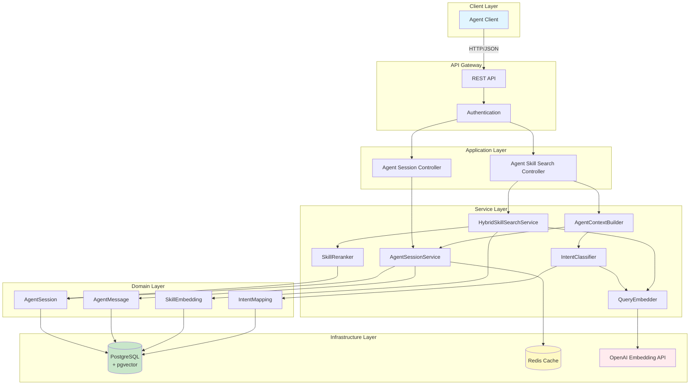
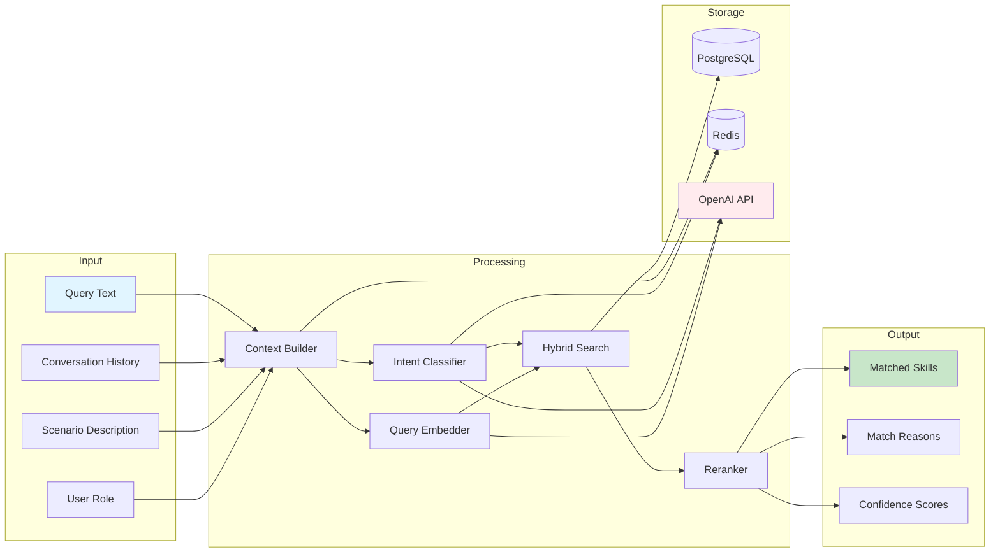
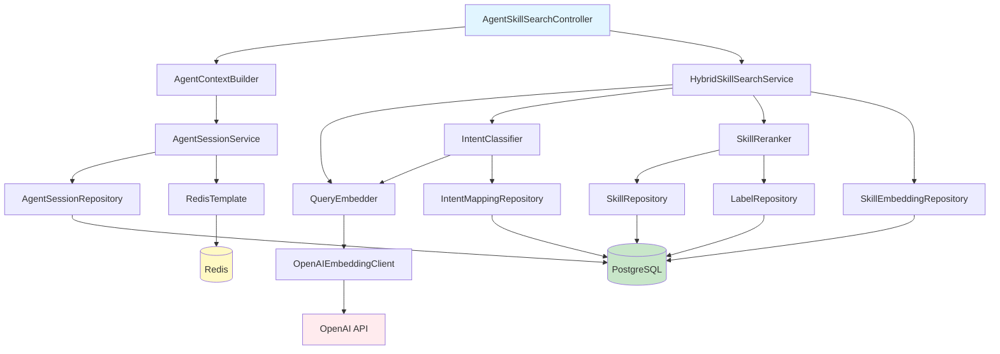
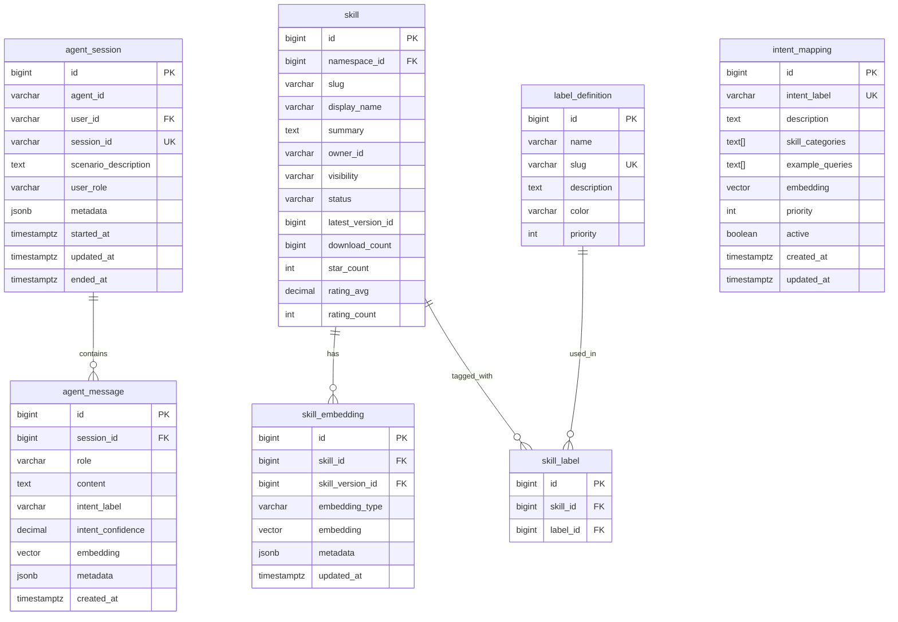
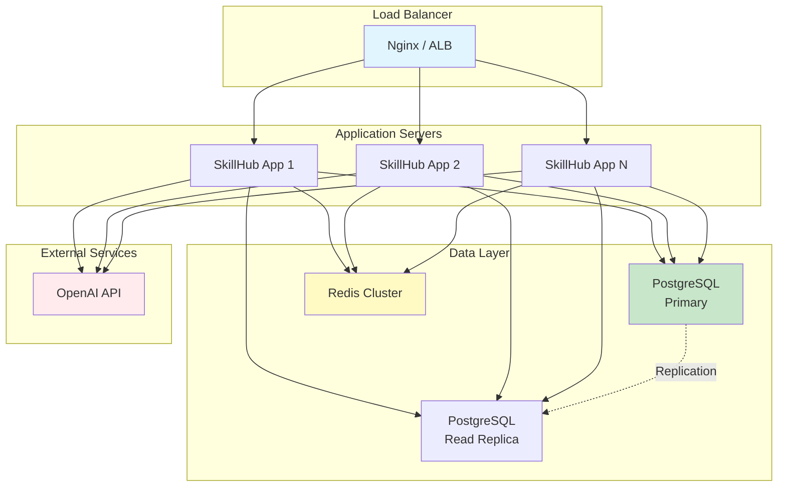
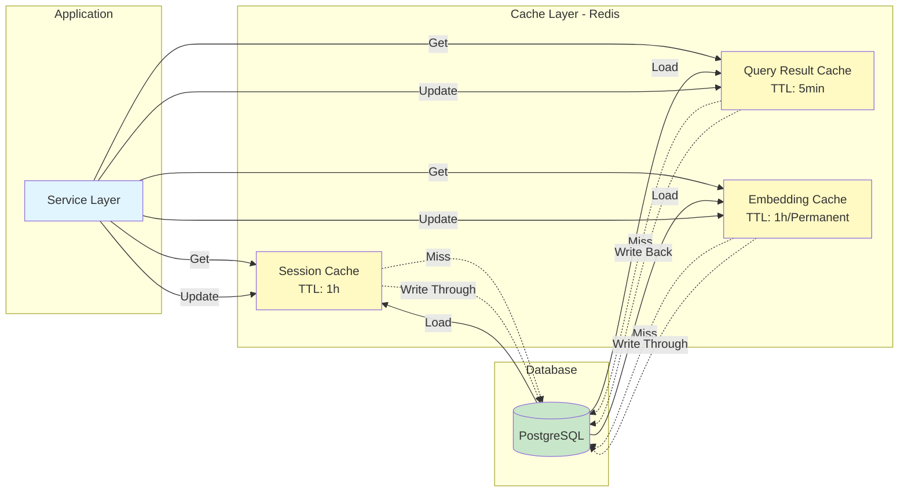
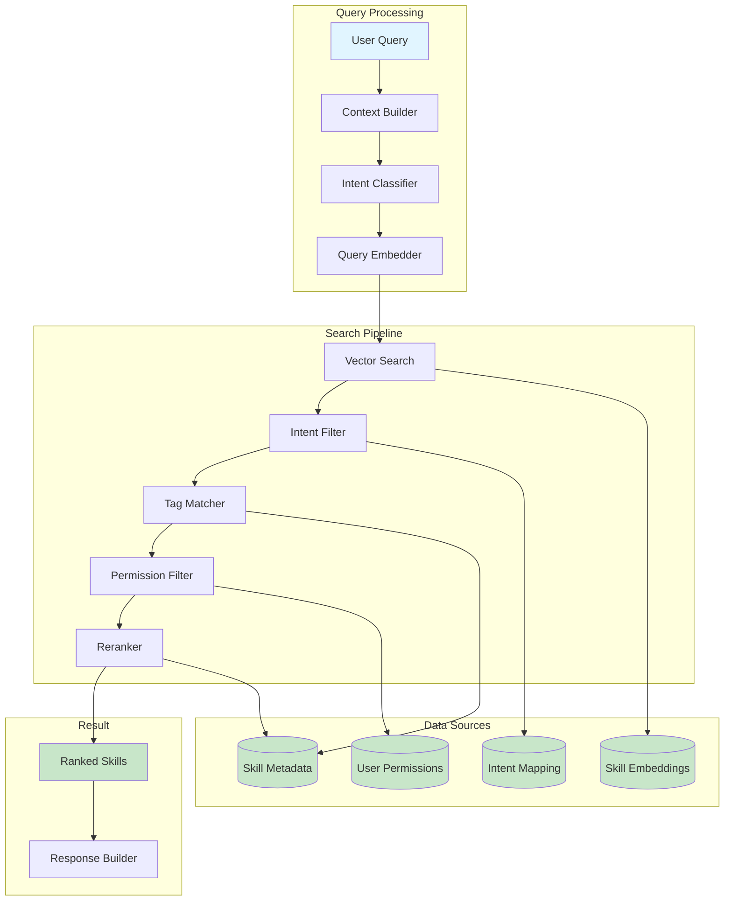
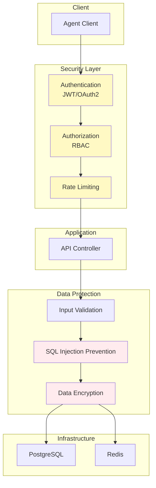
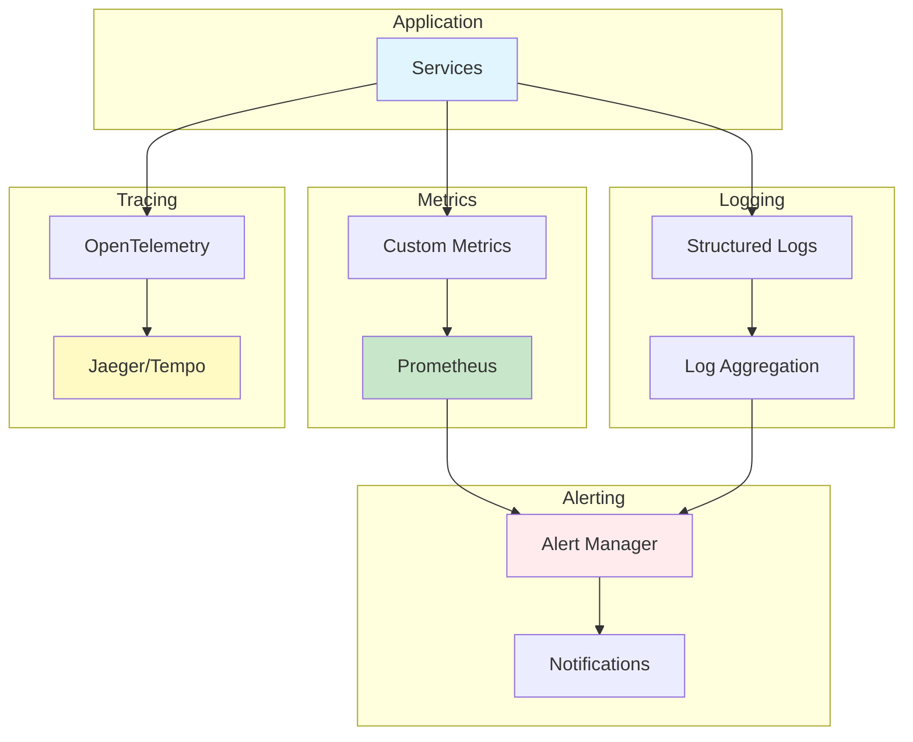
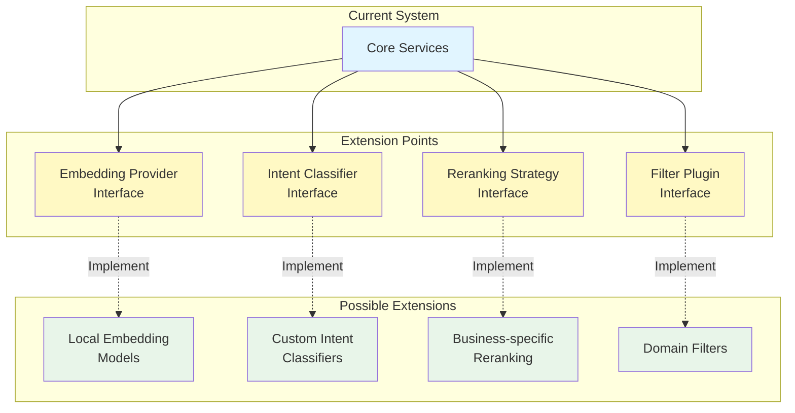

# Agent Skills 智能检索系统 - 架构图

## 1. 系统整体架构

```mermaid
graph TB
    subgraph "Client Layer"
        A[Agent Client]
    end

    subgraph "API Gateway"
        B[REST API]
        C[Authentication]
    end

    subgraph "Application Layer"
        D[Agent Skill Search Controller]
        E[Agent Session Controller]
    end

    subgraph "Service Layer"
        F[AgentContextBuilder]
        G[IntentClassifier]
        H[QueryEmbedder]
        I[HybridSkillSearchService]
        J[SkillReranker]
        K[AgentSessionService]
    end

    subgraph "Domain Layer"
        L[AgentSession]
        M[AgentMessage]
        N[SkillEmbedding]
        O[IntentMapping]
    end

    subgraph "Infrastructure Layer"
        P[(PostgreSQL<br/>+ pgvector)]
        Q[(Redis Cache)]
        R[OpenAI Embedding API]
    end

    A -->|HTTP/JSON| B
    B --> C
    C --> D
    C --> E
    D --> F
    D --> I
    E --> K
    F --> K
    F --> G
    G --> H
    H --> R
    G --> O
    I --> H
    I --> N
    I --> J
    J --> L
    K --> L
    K --> M
    L --> P
    M --> P
    N --> P
    O --> P
    K --> Q

    style A fill:#e1f5ff
    style R fill:#ffebee
    style P fill:#c8e6c9
    style Q fill:#fff9c4
```

## 2. 数据流架构

```mermaid
graph LR
    subgraph "Input"
        A1[Query Text]
        A2[Conversation History]
        A3[Scenario Description]
        A4[User Role]
    end

    subgraph "Processing"
        B1[Context Builder]
        B2[Intent Classifier]
        B3[Query Embedder]
        B4[Hybrid Search]
        B5[Reranker]
    end

    subgraph "Storage"
        C1[(PostgreSQL)]
        C2[(Redis)]
        C3[OpenAI API]
    end

    subgraph "Output"
        D1[Matched Skills]
        D2[Match Reasons]
        D3[Confidence Scores]
    end

    A1 --> B1
    A2 --> B1
    A3 --> B1
    A4 --> B1
    B1 --> B2
    B1 --> B3
    B2 --> C3
    B3 --> C3
    B2 --> B4
    B3 --> B4
    B4 --> C1
    B4 --> B5
    B5 --> D1
    B5 --> D2
    B5 --> D3
    B1 --> C2
    B2 --> C2

    style A1 fill:#e1f5ff
    style C3 fill:#ffebee
    style D1 fill:#c8e6c9
```

## 3. 模块依赖关系

```mermaid
graph TD
    A[AgentSkillSearchController] --> B[AgentContextBuilder]
    A --> C[HybridSkillSearchService]

    B --> D[AgentSessionService]
    D --> E[AgentSessionRepository]
    E --> F[(PostgreSQL)]

    C --> G[QueryEmbedder]
    C --> H[IntentClassifier]
    C --> I[SkillReranker]
    C --> J[SkillEmbeddingRepository]

    G --> K[OpenAIEmbeddingClient]
    K --> L[OpenAI API]

    H --> G
    H --> M[IntentMappingRepository]
    M --> F

    I --> N[SkillRepository]
    I --> O[LabelRepository]
    N --> F
    O --> F

    J --> F

    D --> P[RedisTemplate]
    P --> Q[(Redis)]

    style A fill:#e1f5ff
    style L fill:#ffebee
    style F fill:#c8e6c9
    style Q fill:#fff9c4
```

## 4. 数据库架构

```mermaid
erDiagram
    agent_session ||--o{ agent_message : contains
    skill ||--o{ skill_embedding : has
    skill ||--o{ skill_label : tagged_with
    label_definition ||--o{ skill_label : used_in

    agent_session {
        bigint id PK
        varchar agent_id
        varchar user_id FK
        varchar session_id UK
        text scenario_description
        varchar user_role
        jsonb metadata
        timestamptz started_at
        timestamptz updated_at
        timestamptz ended_at
    }

    agent_message {
        bigint id PK
        bigint session_id FK
        varchar role
        text content
        varchar intent_label
        decimal intent_confidence
        vector embedding
        jsonb metadata
        timestamptz created_at
    }

    skill {
        bigint id PK
        bigint namespace_id FK
        varchar slug
        varchar display_name
        text summary
        varchar owner_id
        varchar visibility
        varchar status
        bigint latest_version_id
        bigint download_count
        int star_count
        decimal rating_avg
        int rating_count
    }

    skill_embedding {
        bigint id PK
        bigint skill_id FK
        bigint skill_version_id FK
        varchar embedding_type
        vector embedding
        jsonb metadata
        timestamptz updated_at
    }

    skill_label {
        bigint id PK
        bigint skill_id FK
        bigint label_id FK
    }

    label_definition {
        bigint id PK
        varchar name
        varchar slug UK
        text description
        varchar color
        int priority
    }

    intent_mapping {
        bigint id PK
        varchar intent_label UK
        text description
        text[] skill_categories
        text[] example_queries
        vector embedding
        int priority
        boolean active
        timestamptz created_at
        timestamptz updated_at
    }
```

## 5. 部署架构

```mermaid
graph TB
    subgraph "Load Balancer"
        LB[Nginx / ALB]
    end

    subgraph "Application Servers"
        APP1[SkillHub App 1]
        APP2[SkillHub App 2]
        APP3[SkillHub App N]
    end

    subgraph "Data Layer"
        PG[PostgreSQL<br/>Primary]
        PG_REPLICA[PostgreSQL<br/>Read Replica]
        REDIS[Redis Cluster]
    end

    subgraph "External Services"
        OPENAI[OpenAI API]
    end

    LB --> APP1
    LB --> APP2
    LB --> APP3

    APP1 --> PG
    APP1 --> PG_REPLICA
    APP1 --> REDIS
    APP1 --> OPENAI

    APP2 --> PG
    APP2 --> PG_REPLICA
    APP2 --> REDIS
    APP2 --> OPENAI

    APP3 --> PG
    APP3 --> PG_REPLICA
    APP3 --> REDIS
    APP3 --> OPENAI

    PG -.->|Replication| PG_REPLICA

    style LB fill:#e1f5ff
    style PG fill:#c8e6c9
    style REDIS fill:#fff9c4
    style OPENAI fill:#ffebee
```

## 6. 缓存架构

```mermaid
graph LR
    subgraph "Application"
        A[Service Layer]
    end

    subgraph "Cache Layer - Redis"
        B1[Session Cache<br/>TTL: 1h]
        B2[Query Result Cache<br/>TTL: 5min]
        B3[Embedding Cache<br/>TTL: 1h/Permanent]
    end

    subgraph "Database"
        C[(PostgreSQL)]
    end

    A -->|Get| B1
    A -->|Get| B2
    A -->|Get| B3

    B1 -.->|Miss| C
    B2 -.->|Miss| C
    B3 -.->|Miss| C

    C -->|Load| B1
    C -->|Load| B2
    C -->|Load| B3

    A -->|Update| B1
    A -->|Update| B2
    A -->|Update| B3

    B1 -.->|Write Through| C
    B2 -.->|Write Back| C
    B3 -.->|Write Through| C

    style A fill:#e1f5ff
    style B1 fill:#fff9c4
    style B2 fill:#fff9c4
    style B3 fill:#fff9c4
    style C fill:#c8e6c9
```

## 7. 搜索流程架构

```mermaid
graph TB
    subgraph "Query Processing"
        A[User Query] --> B[Context Builder]
        B --> C[Intent Classifier]
        C --> D[Query Embedder]
    end

    subgraph "Search Pipeline"
        D --> E[Vector Search]
        E --> F[Intent Filter]
        F --> G[Tag Matcher]
        G --> H[Permission Filter]
        H --> I[Reranker]
    end

    subgraph "Data Sources"
        J[(Skill Embeddings)]
        K[(Intent Mapping)]
        L[(Skill Metadata)]
        M[(User Permissions)]
    end

    subgraph "Result"
        I --> N[Ranked Skills]
        N --> O[Response Builder]
    end

    E --> J
    F --> K
    G --> L
    H --> M
    I --> L

    style A fill:#e1f5ff
    style J fill:#c8e6c9
    style K fill:#c8e6c9
    style L fill:#c8e6c9
    style M fill:#c8e6c9
    style N fill:#c8e6c9
```

## 8. 安全架构

```mermaid
graph TB
    subgraph "Client"
        A[Agent Client]
    end

    subgraph "Security Layer"
        B[Authentication<br/>JWT/OAuth2]
        C[Authorization<br/>RBAC]
        D[Rate Limiting]
    end

    subgraph "Application"
        E[API Controller]
    end

    subgraph "Data Protection"
        F[Input Validation]
        G[SQL Injection Prevention]
        H[Data Encryption]
    end

    subgraph "Infrastructure"
        I[PostgreSQL]
        J[Redis]
    end

    A --> B
    B --> C
    C --> D
    D --> E
    E --> F
    F --> G
    G --> H
    H --> I
    H --> J

    style B fill:#fff9c4
    style C fill:#fff9c4
    style D fill:#fff9c4
    style G fill:#ffebee
    style H fill:#ffebee
```

## 9. 监控与日志架构

```mermaid
graph TB
    subgraph "Application"
        A[Services]
    end

    subgraph "Logging"
        B[Structured Logs]
        C[Log Aggregation]
    end

    subgraph "Metrics"
        D[Prometheus]
        E[Custom Metrics]
    end

    subgraph "Tracing"
        F[OpenTelemetry]
        G[Jaeger/Tempo]
    end

    subgraph "Alerting"
        H[Alert Manager]
        I[Notifications]
    end

    A --> B
    A --> E
    A --> F
    B --> C
    E --> D
    F --> G
    D --> H
    C --> H
    H --> I

    style A fill:#e1f5ff
    style D fill:#c8e6c9
    style G fill:#fff9c4
    style H fill:#ffebee
```

## 10. 扩展性架构

```mermaid
graph TB
    subgraph "Current System"
        A[Core Services]
    end

    subgraph "Extension Points"
        B1[Embedding Provider<br/>Interface]
        B2[Intent Classifier<br/>Interface]
        B3[Reranking Strategy<br/>Interface]
        B4[Filter Plugin<br/>Interface]
    end

    subgraph "Possible Extensions"
        C1[Local Embedding<br/>Models]
        C2[Custom Intent<br/>Classifiers]
        C3[Business-specific<br/>Reranking]
        C4[Domain Filters]
    end

    A --> B1
    A --> B2
    A --> B3
    A --> B4

    B1 -.->|Implement| C1
    B2 -.->|Implement| C2
    B3 -.->|Implement| C3
    B4 -.->|Implement| C4

    style A fill:#e1f5ff
    style B1 fill:#fff9c4
    style B2 fill:#fff9c4
    style B3 fill:#fff9c4
    style B4 fill:#fff9c4
    style C1 fill:#e8f5e9
    style C2 fill:#e8f5e9
    style C3 fill:#e8f5e9
    style C4 fill:#e8f5e9
```
