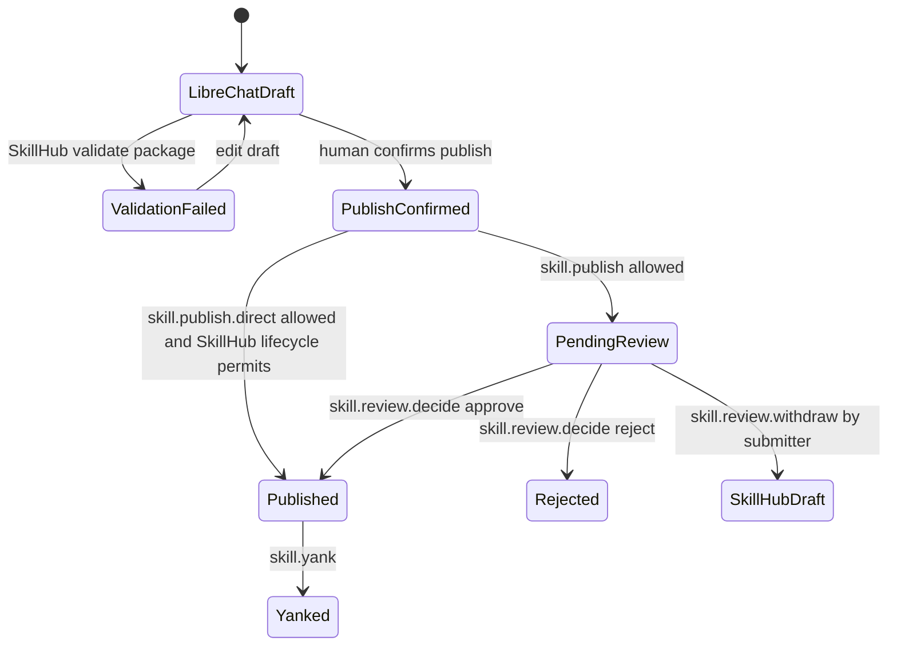

# LibreChat SkillHub Hermes Integration Design

## Status

Draft for review.

## Decision Summary

- SkillHub is the source of truth for shared and published skills.
- LibreChat is the user-facing surface and keeps local skills as private drafts.
- Control Tower is the policy authority for skill access and runtime governance.
- Hermes consumes pinned SkillHub skill versions from LibreChat user profiles.
- SkillHub is internal behind LibreChat in the integrated deployment.
- Runtime action naming uses `skill.invoke`.
- Runtime bundle sync goes through LibreChat; Hermes does not call SkillHub directly in V1.
- Control Tower decisions authorize integrated operations, while SkillHub lifecycle and package safety remain independent enforcement layers.

## System Roles

### LibreChat

- Owns user login, sessions, conversations, and user-facing registry UI.
- Stores per-user installed SkillHub skill pins.
- Stores private draft skills for authoring before submission.
- Calls Control Tower for policy decisions and SkillHub for registry operations through backend adapters.

### Control Tower

- Maps LibreChat external users to Control Tower subjects.
- Stores capability inventory for SkillHub namespaces, skill containers, and versions.
- Evaluates skill permissions for view, install, publish, direct publish, review, manage, and invoke.
- Compiles allowed runtime skills into Hermes capability envelopes.
- Issues and validates per-invocation authorization for `skill.invoke`.

### SkillHub

- Owns registry state, package validation, scanner findings, version lifecycle, review workflow, artifact storage, and audit.
- Exposes internal integration endpoints for LibreChat.
- Validates signed Control Tower decision context for protected integration operations.
- Exports SkillHub capability inventory to Control Tower.

### Hermes

- Runs as server workers for LibreChat.
- Syncs exact pinned SkillHub versions into isolated per-user profiles.
- Loads skills from local synced profile directories.
- Calls Control Tower invocation authorization before skill invocation.

## Resource Model

SkillHub resources are represented in Control Tower with stable resource IDs.

| Resource | Control Tower type | Resource ID |
| --- | --- | --- |
| Namespace | `SKILL_NAMESPACE` | `skillhub:@namespace` |
| Skill container | `SKILL` | `skillhub:@namespace/slug` |
| Skill version | `SKILL_VERSION` | `skillhub:@namespace/slug@version` |
| Review task | `SKILL_REVIEW_TASK` | `skillhub:review-task:{reviewTaskPublicId}` |

Capability metadata should include SkillHub namespace, slug, version when present, visibility, lifecycle status, scanner verdict, latest version marker, owner, source, and updated timestamp. Review task metadata must include the subject skill version resource ID, submitter subject, review status, and created timestamp. Audit read checks reuse the namespace, skill container, skill version, or review task resource that scopes the audit request; V1 does not introduce a separate audit resource type.

### Resource ID Grammar

Resource IDs are canonical ASCII strings:

```text
namespace-id = "skillhub:@" namespace-slug
skill-id     = "skillhub:@" namespace-slug "/" skill-slug
version-id   = "skillhub:@" namespace-slug "/" skill-slug "@" version
review-id    = "skillhub:review-task:" review-task-id
```

- `namespace-slug` and `skill-slug` use SkillHub's existing slug validation and are emitted in normalized lowercase form.
- `version` is the exact SkillHub version string. For integrated SkillHub-published versions, publishing and rerelease paths must reject versions outside `[0-9A-Za-z][0-9A-Za-z._+-]{0,127}`; versions must not contain `/`, whitespace, `%`, or `@`. Existing standalone versions outside this grammar must be rejected by integrated install/runtime flows until migrated or republished.
- `review-task-id` is the stable SkillHub public review task ID, not an internal database primary key. `/reviews/{id}` path IDs must equal the `review-task-id` suffix in the signed resource ID.
- Tags such as `latest` are not valid runtime resource IDs. They must be resolved to exact versions before policy evaluation.
- Version resources carry `parentSkillId` and `parentNamespaceId` metadata for policy inheritance and audit explanations.
- Resource IDs must be carried as JSON fields or query values with standard URL encoding. Do not place raw skill resource IDs in path segments because they contain `/` and `@`.
- Invalid examples: `skillhub:team/skill`, `skillhub:@team/skill@latest`, `skillhub:@Team/Skill@1.0.0`, `skillhub:@team/skill@1/2`, `skillhub:review-task:`.

### Artifact Fingerprint Contract

SkillHub, LibreChat, and Hermes use a single artifact fingerprint format:

```text
artifact-fingerprint = "sha256:" 64-lowercase-hex
```

- The digest input is the exact SkillHub stored bundle byte stream returned by `/skills/download`.
- SkillHub computes the digest after package validation, scanner policy evaluation, and final bundle persistence, before any transport encoding.
- LibreChat stores the fingerprint verbatim in profile pins and must not recompute it from unpacked files.
- Hermes recomputes SHA-256 on the downloaded byte stream before extraction, compares lowercase hex in constant time, and discards the bundle on mismatch.
- If SkillHub repacks or normalizes a bundle, it must produce a new fingerprint and exact version artifact record; existing pins are disabled until the user explicitly updates.

## Actions

| Action | Resource | Purpose |
| --- | --- | --- |
| `skill.view` | Namespace, container, version | User can discover or inspect the registry object. |
| `skill.install` | Version | User can install or download the exact version to their profile. |
| `skill.publish` | Namespace or container | User can submit a draft to SkillHub review or normal publish flow. |
| `skill.publish.direct` | Namespace or container | User can publish directly when SkillHub lifecycle also permits it. |
| `skill.review.decide` | `SKILL_REVIEW_TASK` | Reviewer can approve or reject review decisions. |
| `skill.review.withdraw` | `SKILL_REVIEW_TASK` | Submitter can withdraw their own pending review to `DRAFT`. |
| `skill.archive` | Container | Owner or namespace admin can archive or unarchive a skill. |
| `skill.visibility.manage` | Container | Platform governance can hide or restore a skill. |
| `skill.yank` | Version | Platform governance can yank a published version. |
| `skill.label.attach` | Container or version | Authorized editor can attach or detach existing non-privileged labels. |
| `skill.label.definition.manage` | Namespace, container, or version | Platform governance can manage global, privileged, or governed label definitions and assignments. |
| `skill.invoke` | Version | Hermes can invoke the pinned skill during a governed run. |
| `skill.audit.read` | Namespace, container, version, or review task | Admin or auditor can read skill audit history. |

## Integration Architecture

### Registry Search Flow

LibreChat does not ask Control Tower to authorize unknown SkillHub resources. Instead, search uses Control Tower's imported SkillHub capability inventory as the prefilter, then hydrates allowed details from SkillHub.

```mermaid
sequenceDiagram
    participant U as User
    participant LC as LibreChat
    participant CT as Control Tower
    participant SH as SkillHub
    participant H as Hermes Worker

    U->>LC: Browse registry
    LC->>CT: Search inventory and evaluate skill.view
    CT-->>LC: Allowed resource IDs + signed view tokens
    LC->>SH: Hydrate allowed details with signed view tokens
    SH-->>LC: Lifecycle-visible registry data
    LC-->>U: Allowed skills

    U->>LC: Install pinned version
    LC->>CT: Check skill.install
    LC->>SH: Resolve exact published version
    SH-->>LC: Version metadata + artifact fingerprint
    LC->>LC: Store user profile pin

    U->>LC: Start Hermes run
    LC->>LC: Resolve selected pins from server-side profile
    LC->>CT: Compile envelope with requested skills
    CT-->>LC: Signed capability envelope
    LC->>H: Dispatch with envelope and pins
    H->>LC: Request pinned bundle sync
    LC->>CT: Recheck skill.install; verify envelope contains skill.invoke
    LC->>SH: Download exact version with signed skill.install token
    SH-->>LC: Bundle + fingerprint
    LC-->>H: Bundle + fingerprint
    H->>CT: Authorize skill.invoke
    CT-->>H: Invocation authorization
    H-->>LC: Run result and activity
```

### Draft Publish Flow



LibreChat owns draft text and draft attachments until publish submission. SkillHub owns package bytes, scanner results, version rows, review tasks, and audit records after submission. Submitter withdrawal is a SkillHub lifecycle transition from `PENDING_REVIEW` to `DRAFT`; it does not delete the version and does not hand package authority back to browser-local state. SkillHub audit and submitter-only checks use Control Tower `sub` as the canonical actor key; LibreChat `externalUserId` is retained as secondary display and audit attribution only.

## Integrated Deployment Boundary

- SkillHub has an integrated mode that assumes end-user traffic arrives through LibreChat.
- In integrated mode, public internet ingress exposes LibreChat only. SkillHub is reachable through an internal network name or service mesh policy.
- If an operator intentionally exposes SkillHub in integrated mode, protected registry routes must reject requests that lack valid service authentication and signed Control Tower decision context.
- Existing standalone SkillHub public and CLI APIs remain available when integrated mode is disabled.
- Deployment tests must prove direct browser/user access cannot perform protected search, install/download, publish, review, or manage operations in integrated mode.

## Control Tower Design

### Capability Inventory

Control Tower imports SkillHub capability inventory from SkillHub. Inventory sync is idempotent and creates or updates capabilities for:

- Active namespaces as `SKILL_NAMESPACE`.
- Skill containers as `SKILL`.
- Published versions as `SKILL_VERSION`.
- Pending review tasks as `SKILL_REVIEW_TASK`.

Deleted or archived SkillHub objects should disable or deprecate corresponding capabilities rather than hard-delete them immediately, so policy and audit history remain understandable.

Lifecycle deltas and scanner policy deltas must invalidate or disable affected capabilities for hidden, archived, yanked, rejected, scanner-blocked, and deleted versions. Review-task deltas must create pending review task capabilities and disable them after approve, reject, withdraw, or version deletion. Control Tower policy can only allow currently active capabilities; SkillHub still performs final lifecycle checks.

### Batch Permission Evaluation

Add a service-facing batch permission API for LibreChat and SkillHub adapters. It accepts trusted service auth plus:

- External LibreChat user ID.
- Workspace and optional agent context.
- A list of action/resource checks.

It returns:

- Decision per action/resource.
- Policy version.
- Safe explanation.
- Obligations.
- Short-lived signed decision token for fully allowed protected SkillHub operations.

The token is intended for SkillHub internal integration calls, not browser consumption. `LIMIT` decisions may be useful to LibreChat for UI explanations or follow-up checks, but they do not receive SkillHub decision tokens in V1.

Service identities are distinct from actor subjects. Control Tower authorizes LibreChat registry adapters with a service principal scoped to decision APIs, and SkillHub capability export callers with a service principal scoped to `control-tower:capability-read`. SkillHub validates LibreChat calls with a separate `librechat:registry-adapter` service principal. These service credentials prove the calling service, while decision tokens prove the user/workspace/action/resource authorization.

### Service Contract: Control Tower Decisions

| API | Caller | Purpose | Response |
| --- | --- | --- | --- |
| `POST /v1/skills/registry/search` | LibreChat backend | Search imported SkillHub inventory and evaluate `skill.view`. | Allowed resource IDs, display-safe summaries, policy version, signed view tokens. |
| `POST /v1/permissions/batch` | LibreChat backend | Evaluate concrete action/resource checks. | Per-check decision, safe explanation, obligations, optional signed decision token. |
| `POST /internal/invocations/authorize` | Hermes or LibreChat runtime adapter | Authorize one `skill.invoke`. | Signed invocation authorization or denial. |

All APIs use existing Control Tower service authentication and contract-version headers. Responses use the shared error envelope described in the internal endpoint contract below.

Minimum Control Tower request shapes:

```json
{
  "externalUserId": "librechat_user_456",
  "externalWorkspaceId": "workspace_789",
  "agentContext": {
    "agentId": "hermes-agent"
  },
  "checks": [
    {
      "action": "skill.install",
      "resourceType": "SKILL_VERSION",
      "resourceId": "skillhub:@team/summarizer@1.2.3",
      "method": "POST",
      "path": "/internal/integrations/librechat/skillhub/skills/download",
      "bodySha256": "sha256:..."
    }
  ]
}
```

Minimum Control Tower decision response:

```json
{
  "decisions": [
    {
      "action": "skill.install",
      "resourceType": "SKILL_VERSION",
      "resourceId": "skillhub:@team/summarizer@1.2.3",
      "decision": "ALLOW",
      "policyVersion": "2026-05-29T10:15:00Z",
      "safeExplanation": "Allowed by workspace skill policy.",
      "obligations": [],
      "decisionToken": "..."
    }
  ]
}
```

For `DENY` or `LIMIT`, `decisionToken` must be omitted. `LIMIT` obligations are returned for the caller to satisfy before rechecking; SkillHub does not enforce unsigned obligations.

### Signed Decision Token Contract

Decision tokens are compact signed JSON payloads produced by Control Tower and consumed by SkillHub. Single-resource protected operations transport one token in `X-Control-Tower-Decision-Token`; endpoint-specific exceptions such as hydrate are listed in the internal endpoint contract. Decision tokens are never exposed to the browser. Production signing is asymmetric: Control Tower owns private signing keys, and SkillHub, LibreChat, and Hermes may receive only public verification metadata. Token serialization is:

```text
base64url(jcs-canonical-json-claims) "." "v1.ed25519=" base64url(ed25519-signature(canonical-claims))
```

Canonical JSON uses RFC 8785 JSON Canonicalization Scheme semantics: UTF-8, lexicographically sorted object keys, no insignificant whitespace, and normalized JSON number/string encoding. `method` is uppercase, `path` is the normalized integration route path without query parameters, and any query string used by an endpoint must be represented in either the request body or a signed `querySha256` claim before the endpoint may trust it. Test fixtures may embed fixture private keys for deterministic local contract tests; production configuration must never share Control Tower private keys with SkillHub, LibreChat, or Hermes.

`bodySha256` is computed over the exact HTTP request body bytes after content encoding is decoded and before the application parser mutates the payload. For JSON requests this is the UTF-8 body bytes sent on the wire, not parsed object reserialization. Every protected V1 endpoint with a request body requires `bodySha256`, including read-style POSTs such as resolve, download, and audit query. The only exception is `POST /skills/hydrate`, where each item carries a `skill.view` token for that specific resource and the endpoint has no header-level decision token. For multipart requests, protected mutating calls must use a JSON package reference created by a prior upload/validation step; raw multipart bytes are not signed in V1. `querySha256` is computed over the normalized query string with keys sorted lexicographically and percent-encoding normalized to uppercase hex. V1 protected endpoints should carry semantic parameters in JSON bodies; if a future protected endpoint accepts semantic query parameters, it must include `querySha256`.

Required claims:

| Claim | Meaning |
| --- | --- |
| `iss` | Control Tower issuer ID. |
| `aud` | Intended service, usually `skillhub`. |
| `kid` | Signing key ID. |
| `sub` | Control Tower subject ID. |
| `externalUserId` | LibreChat external user ID. |
| `externalWorkspaceId` | Workspace or tenant context. |
| `action` | Allowed action such as `skill.install`. |
| `resourceType` | `SKILL_NAMESPACE`, `SKILL`, `SKILL_VERSION`, or `SKILL_REVIEW_TASK`. |
| `resourceId` | Canonical SkillHub resource ID. |
| `method` | HTTP method for the SkillHub integration request. |
| `path` | Canonical SkillHub integration path. |
| `bodySha256` | Required for every protected request body except per-item hydrate tokens. |
| `querySha256` | Required only when an endpoint accepts semantically meaningful query parameters. |
| `policyVersion` | Policy version that produced the decision. |
| `decision` | Must be `ALLOW`; denial and `LIMIT` tokens are not accepted by SkillHub. |
| `nonce` | Unique token nonce. |
| `iat`, `exp` | Issued and expiry timestamps. |

Defaults:

- Token TTL is 5 minutes.
- Accepted clock skew is 60 seconds.
- SkillHub accepts tokens signed by the active public key and previous rotation public key only for the maximum token TTL plus clock skew; unknown `kid` values are rejected.
- Download and mutating tokens are single-use and stored by `nonce` in SkillHub replay protection for at least token TTL plus clock skew. View and audit tokens are also nonce-checked for replay telemetry and abuse detection, but only download and mutation tokens consume the nonce on successful domain execution.
- Tokens are rejected for wrong audience, wrong method, wrong path, wrong query hash, wrong body hash, wrong action/resource, stale policy version, unsupported `LIMIT` decision, expiry, unknown key ID, invalid signature, replay, or replay-store unavailability. Protected download, publish, review, governance, and audit operations fail closed if the current policy freshness store is unavailable.
- SkillHub logs only token ID or nonce hash, never the raw token.

Example unsigned claims before canonicalization:

```json
{
  "iss": "control-tower",
  "aud": "skillhub",
  "kid": "ct-skillhub-2026-05",
  "sub": "ct_subject_123",
  "externalUserId": "librechat_user_456",
  "externalWorkspaceId": "workspace_789",
  "action": "skill.install",
  "resourceType": "SKILL_VERSION",
  "resourceId": "skillhub:@team/summarizer@1.2.3",
  "method": "POST",
  "path": "/internal/integrations/librechat/skillhub/skills/download",
  "bodySha256": "sha256:...",
  "policyVersion": "2026-05-29T10:15:00Z",
  "decision": "ALLOW",
  "nonce": "01HX...",
  "iat": 1780000000,
  "exp": 1780000300
}
```

### Runtime Envelope

LibreChat sends pinned version resource IDs in `requested.skills`. Control Tower maps them to `EnvelopeRequestedResource` entries with:

- `resourceType = SKILL_VERSION`
- `resourceId = skillhub:@namespace/slug@version`
- `action = skill.invoke`

Existing envelope and invocation authorization semantics should remain intact.

## SkillHub Design

### Trusted Decision Validation

SkillHub adds an internal integration authentication layer that validates Control Tower signed decision context. Validation checks:

- Signature and key ID.
- Expiry.
- Nonce replay protection.
- Actor subject and external user ID presence.
- Action and resource match the requested operation.
- Policy version and decision outcome are allowed.

After validation, SkillHub projects an actor context into the request for audit and existing services.

For internal integration endpoints, Control Tower authorization replaces SkillHub's local platform and namespace RBAC check for the requested action. It does not replace domain lifecycle rules, package validation, scanner policy, ownership-specific invariants such as submitter-only withdrawal, or audit redaction. Implement this as an explicit integration permission adapter, not by injecting fabricated SkillHub roles into request attributes.

Actor projection stores `sub` as the primary immutable actor identifier for submitter-only comparisons, review attribution, and audit correlation. `externalUserId` is stored as secondary external identity metadata and must not be used as the equality key for ownership checks because external IDs can be renamed or remapped.

### Lifecycle Enforcement

Control Tower permission is necessary but not sufficient. SkillHub still enforces:

- Namespace status and membership-compatible lifecycle rules.
- Published-only resolution and download for install/runtime use.
- Hidden, archived, yanked, rejected, and scanner-blocked restrictions.
- Package policy, scanner warnings, and review workflow.
- Idempotency and audit behavior on mutating operations.

Direct publish does not bypass distribution safety. If a direct-publish path creates a `PUBLISHED` version before the scanner reaches an acceptable verdict, integrated resolve/download/sync/runtime endpoints must treat the version as scanner-blocked until scanner/package policy marks the exact artifact download-ready.

### Internal Endpoints

Internal endpoints are scoped to LibreChat integration and are not a public browser contract:

| Method | Path | Purpose | Required Action |
| --- | --- | --- | --- |
| `GET` | `/internal/integrations/librechat/skillhub/capabilities` | Export lifecycle-safe capability inventory to Control Tower. | Service auth only. |
| `POST` | `/internal/integrations/librechat/skillhub/skills/hydrate` | Hydrate allowed search/detail results by resource ID. | `skill.view` |
| `POST` | `/internal/integrations/librechat/skillhub/skills/resolve` | Resolve exact published version metadata and fingerprint. | `skill.install` or `skill.invoke` |
| `POST` | `/internal/integrations/librechat/skillhub/skills/download` | Download exact published version bundle. | `skill.install` |
| `POST` | `/internal/integrations/librechat/skillhub/drafts/validate` | Validate LibreChat draft package without publishing. | Service auth only. |
| `POST` | `/internal/integrations/librechat/skillhub/drafts/publish` | Submit confirmed draft to SkillHub publish/review flow. | `skill.publish` or `skill.publish.direct` |
| `POST` | `/internal/integrations/librechat/skillhub/reviews/{id}/decisions` | Approve or reject review task. | `skill.review.decide` |
| `POST` | `/internal/integrations/librechat/skillhub/reviews/{id}/withdraw` | Submitter withdraws pending review. | `skill.review.withdraw` |
| `POST` | `/internal/integrations/librechat/skillhub/audit/query` | Query redacted audit records for a scoped resource. | `skill.audit.read` |
| `POST` | `/internal/integrations/librechat/skillhub/governance/actions` | Archive, unarchive, hide, restore, yank, attach labels, or manage label definitions. | `skill.archive`, `skill.visibility.manage`, `skill.yank`, `skill.label.attach`, or `skill.label.definition.manage` according to action |

Internal install and runtime endpoints must use published-only resolution and reject hidden, archived, yanked, rejected, pending-review, draft, or scanner-blocked versions. They must return the artifact fingerprint with metadata and bundle responses.

Runtime download authorization is layered:

- SkillHub validates a single `skill.install` decision token for `/skills/download` and performs lifecycle, scanner, and artifact checks.
- LibreChat may request a runtime download only after the Control Tower envelope already contains `skill.invoke` for the same `SKILL_VERSION`.
- Hermes still calls Control Tower per-invocation authorization before execution. A runtime download never substitutes for invocation authorization.

Public or standalone SkillHub APIs remain available for non-integrated deployments, but the integrated deployment routes user traffic through LibreChat.

### Internal Endpoint Contract

All internal LibreChat-to-SkillHub endpoints use:

- `Authorization: Bearer {service-token}` for service authentication. Capability export accepts only a Control Tower service principal with `control-tower:capability-read`; LibreChat registry endpoints accept only a LibreChat service principal with `librechat:registry-adapter`.
- `X-Control-Tower-Decision-Token: {token}` for single-resource protected operations, except capability export and non-mutating package validation where service auth plus later publish authorization is sufficient.
- `X-SkillHub-Integration-Contract: librechat-skillhub-hermes.v1` for contract version negotiation.
- `Idempotency-Key` on mutating publish, review, withdraw, and governance operations. SkillHub download and resolve calls are read-only; LibreChat pin mutations are idempotent in LibreChat, not SkillHub.

Protected calls missing a required decision token, carrying an empty token, or carrying multiple decision-token headers fail with `403 DECISION_TOKEN_REQUIRED` before domain workflow execution. `POST /skills/hydrate` is the only V1 multi-token exception: it does not use `X-Control-Tower-Decision-Token`; each item carries its own `decisionToken`, and SkillHub authorizes each item independently. Hydrate is fail-closed for V1: if any requested item has a missing, invalid, mismatched, expired, or replayed token, the whole hydrate request returns `403` and no registry details.

Validation order for protected mutating endpoints is:

1. Validate service authentication and contract version.
2. Validate request shape and required idempotency key.
3. If the same idempotency key and exact body hash already completed, return the stored response without consuming a new decision token.
4. If the idempotency key was used with a different body hash, return `409 IDEMPOTENCY_CONFLICT`.
5. For a new mutation, validate and consume a fresh decision token before executing the domain workflow.
6. Replaying a previously consumed token with a new idempotency key is rejected as `DECISION_TOKEN_REPLAYED`.

All JSON responses use:

```json
{
  "data": {},
  "error": null,
  "requestId": "req_..."
}
```

Error responses use the same envelope with `data = null` and:

```json
{
  "error": {
    "code": "DECISION_TOKEN_REPLAYED",
    "message": "The authorization context is no longer valid.",
    "details": {
      "resourceId": "skillhub:@team/summarizer@1.2.3"
    }
  }
}
```

Status code mapping:

| Status | Meaning |
| --- | --- |
| `400` | Malformed request, invalid resource ID grammar, missing/unsupported contract version, unsupported action, or missing idempotency key. |
| `401` | Missing or invalid service authentication. |
| `403` | Wrong service principal or scope; missing, invalid, mismatched, expired, replayed, `LIMIT`, or denied Control Tower decision context. |
| `404` | Resource not found or not lifecycle-visible for the requested operation. |
| `409` | Idempotency conflict, lifecycle conflict, duplicate version, or stale publish/review state. |
| `422` | Package validation, scanner policy, or warning-confirmation failure. |
| `503` | SkillHub dependency unavailable, replay store unavailable, or scanner unavailable when policy requires it. |

Minimum request and response shapes:

| Endpoint | Request | Response Notes |
| --- | --- | --- |
| `GET /capabilities` | Query: `cursor`, `limit`, `updatedAfter`. | Paginated `items[]` with `resourceType`, `resourceId`, parent IDs, lifecycle, scanner verdict, visibility, `updatedAt`, `deletedOrDisabled`. |
| `POST /skills/hydrate` | `{ "items": [{ "resourceId": "...", "decisionToken": "..." }] }` | One `skill.view` token per item. SkillHub validates each token against that item and never hydrates IDs without matching tokens. |
| `POST /skills/resolve` | `{ "resourceId": "skillhub:@namespace/slug@version", "purpose": "install|runtime" }` | Exact published version metadata, artifact fingerprint, scanner verdict, and update metadata. |
| `POST /skills/download` | `{ "resourceId": "...", "purpose": "install|runtime", "envelopeId": "optional" }` | JSON envelope with artifact fingerprint and a one-time internal bundle handle. The handle is mTLS/internal-only, one-use, short TTL, non-loggable, audience-bound to LibreChat/Hermes, and fingerprint-bound. V1 does not return raw streams or pre-signed URLs from this endpoint. SkillHub validates the single `skill.install` token; runtime purpose is only called after LibreChat verifies envelope `skill.invoke`. |
| `POST /drafts/validate` | Multipart or package manifest plus draft metadata. | Service-auth-only validation result, scanner warnings where available, package policy warnings, and `requiresConfirmation`; publish authorization is checked later on `/drafts/publish`. |
| `POST /drafts/publish` | Package reference, namespace, slug, version, confirmation flag, publish mode. | Created SkillHub version, review task when required, lifecycle state, and audit ID. |
| `POST /reviews/{id}/decisions` | `{ "decision": "APPROVE|REJECT", "reason": "..." }` | Review task result and resulting version lifecycle state. |
| `POST /reviews/{id}/withdraw` | `{ "reason": "optional" }` | Requires submitter token; returns version in `DRAFT` and deletes the pending review task. |
| `POST /audit/query` | `{ "resourceId": "...", "cursor": null, "limit": 50 }` | Redacted audit records scoped to namespace, skill, version, or review task. |
| `POST /governance/actions` | Discriminated union keyed by `action`: `ARCHIVE|UNARCHIVE` require container resource and `skill.archive`; `HIDE|RESTORE` require container resource and `skill.visibility.manage`; `YANK` requires version resource and `skill.yank`; `LABEL_ATTACH|LABEL_DETACH` require container/version resource and `skill.label.attach`; `LABEL_DEFINITION_CREATE|LABEL_DEFINITION_UPDATE|LABEL_DEFINITION_DELETE|PRIVILEGED_LABEL_APPLY` require namespace/container/version resource and `skill.label.definition.manage`. | Resulting lifecycle/projection state and audit ID. Unknown actions or mismatched resource types return `400 UNSUPPORTED_GOVERNANCE_ACTION`. |

List responses use cursor pagination:

```json
{
  "data": {
    "items": [],
    "nextCursor": null
  },
  "error": null,
  "requestId": "req_..."
}
```

### Audit And Log Redaction

Internal integration logging is allowlist-based. Security logs may include request ID, service principal, actor `sub`, external user ID, workspace ID, action, resource ID, policy version, decision-token nonce hash, bundle handle ID hash, status code, and bounded error code. Logs and audit summaries must not include raw decision tokens, service bearer tokens, bundle handles, package bytes, uploaded filenames before sanitization, raw denial reasons from policy engines, or unbounded free-form review/governance reasons. Full internal audit records, if retained, require a separate privileged audit view and the same redaction tests as API responses.

## LibreChat Design

### Backend Adapters

LibreChat adds backend services for:

- Control Tower batch decisions.
- SkillHub registry operations with signed decision context.
- User profile skill pin persistence.
- Draft packaging and publish submission.
- Hermes run request population from profile pins.

Browser clients call LibreChat only. They do not call SkillHub or Control Tower directly for protected registry operations.

### User Profile Pins

Each installed skill pin stores:

- Resource ID: `skillhub:@namespace/slug@version`.
- Namespace, slug, version.
- Artifact fingerprint from SkillHub.
- Display name and description snapshot.
- Installed by, installed at, updated at.
- Last sync status, disabled reason, and last revalidation timestamp.

Pins are per user in V1. Workspace or agent-level pins are future work.

### UI Surfaces

- Skill Registry: search, filters, skill cards, detail drawer/page, version selector.
- Installed Skills: profile pins, update availability, remove action, sync status.
- Draft Skills: local private skill drafts, import, edit, validate, publish confirmation.
- Admin Review: pending reviews, governance actions, and safe denial explanations.

## Hermes Design

Hermes adds SkillHub sync support for server workers:

- Resolve pinned version metadata from LibreChat's backend adapter.
- Download exact SkillHub bundle through LibreChat's backend adapter.
- Quarantine and scan before install.
- Install into per-user Hermes profile directory.
- Record provenance, checksum, version, source, scan verdict, and install path.
- Load only the skills selected for the governed run.
- Call Control Tower invocation authorization for `skill.invoke` before use.
- Verify SkillHub artifact fingerprint before installing or loading the bundle.
- Store synced SkillHub bundles outside legacy local-skill loader roots. The Hermes loader must require provenance `source = skillhub`, exact version resource ID, envelope membership, and per-invocation authorization before exposing a synced skill to execution. A synced bundle that is present on disk but lacks any of those proofs is ignored and reported as denied.

Hermes publish remains a draft proposal flow in V1. It creates or updates a LibreChat draft and waits for human confirmation before SkillHub submission.

## Failure Modes

| Condition | Detector | Default Behavior | Retry | User Message Owner | Audit/Metric |
| --- | --- | --- | --- | --- | --- |
| Control Tower unavailable | LibreChat backend decision call fails | Fail closed when enforcement is enabled | Safe retry with backoff | LibreChat | `controltower.decision.unavailable` |
| SkillHub unavailable | LibreChat SkillHub adapter fails | Do not mutate pins or drafts | Safe retry with backoff | LibreChat | `skillhub.integration.unavailable` |
| Decision token mismatch or replay | SkillHub token validator | Reject request | No automatic retry with same token | LibreChat | Security audit with nonce hash |
| Pinned version invalidated | Pin revalidation or sync | Mark pin disabled; fail selected run | Retry after user update | LibreChat | `skill.pin.disabled` |
| Artifact fingerprint mismatch | Hermes sync verification | Delete quarantine bundle; fail selected run | Retry only after re-resolve | LibreChat/Hermes | `skill.bundle.integrity_failed` |
| Missing `skill.invoke` authorization | Hermes invocation guard | Deny invocation | No retry without new envelope | Hermes/LibreChat | `skill.invoke.denied` |

## Rollout And Compatibility

| Flag | Repo | Default | Enables | Rollback Behavior |
| --- | --- | --- | --- | --- |
| `CONTROL_TOWER_SKILLHUB_INVENTORY` | Control Tower | off | SkillHub capability inventory import. | Stop sync; existing capabilities remain disabled/inert. |
| `SKILLHUB_INTEGRATED_MODE` | SkillHub | off | Internal LibreChat endpoints and decision validation. | Disable internal endpoints; standalone APIs unchanged. |
| `LIBRECHAT_SKILLHUB_REGISTRY` | LibreChat | off | Registry UI and read-only browse. | Hide UI; no pin mutation. |
| `LIBRECHAT_SKILLHUB_PINS` | LibreChat | off | Profile pin write paths. | Existing pins remain read-only diagnostics. |
| `LIBRECHAT_SKILLHUB_RUNTIME_REQUESTS` | LibreChat | off | Adding profile pins to `requested.skills` for Hermes runs. | Do not include pinned skills in run requests. |
| `HERMES_SKILLHUB_SYNC` | Hermes | off | Bundle sync through LibreChat. | Stop sync; existing bundles ignored for governed runs. |
| `HERMES_SKILL_INVOKE_ENFORCEMENT` | Hermes | off | Per-invocation `skill.invoke` guard. | Do not allow SkillHub pinned skills in governed runs. |

Runtime flag dependency: `LIBRECHAT_SKILLHUB_RUNTIME_REQUESTS` and `HERMES_SKILLHUB_SYNC` may be enabled for governed runs only after `HERMES_SKILL_INVOKE_ENFORCEMENT` is enabled in the same environment and tests prove a synced on-disk skill cannot run without envelope membership and per-invocation authorization. `HERMES_SKILLHUB_SYNC` may prefetch into quarantine for diagnostics, but promoted installed bundles must be ignored whenever invoke enforcement is disabled.

Report-only mode is visibility diagnostics only. In report-only, Control Tower may return would-allow or would-deny explanations to LibreChat for registry browse telemetry, but it must not mint SkillHub decision tokens for would-deny checks and must not allow pin mutation, draft publish, review decision, download, sync, governance mutation, or runtime invocation that would fail in enforced mode.

## Compatibility

- Existing standalone SkillHub APIs remain intact.
- Existing LibreChat local skills are retained as private drafts and are not migrated automatically.
- Existing Control Tower envelope and invocation APIs remain compatible; `skill.invoke` is added to the runtime resource set.
- Existing Hermes local skill loading remains the execution mechanism for synced SkillHub bundles. Non-SkillHub local execution paths, if enabled by a deployment, are outside this registry contract and must not satisfy `requested.skills` or bypass `skill.invoke` authorization for pinned SkillHub resources.
