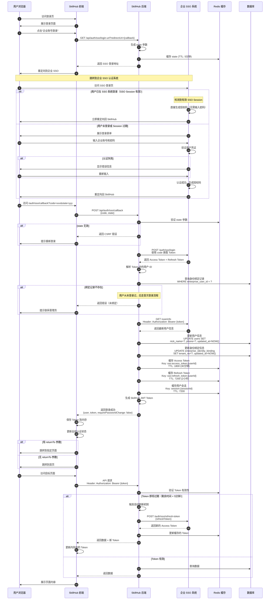
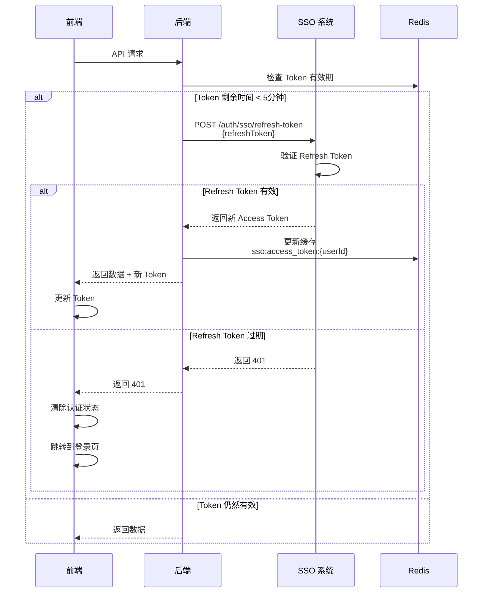

# 企业 SSO 常规登录流程

## 流程图



## 常规登录 vs 首次登录对比

| 特性 | 首次登录 | 常规登录 |
|------|----------|----------|
| **SSO Session** | 不存在 | 可能存在（免密登录） |
| **绑定记录** | 不存在，需创建 | 已存在，直接使用 |
| **修改密码** | 必须修改 | 不需要 |
| **账号创建** | 需要创建平台账号 | 已有账号，更新信息 |
| **用户体验** | 需要额外操作 | 流畅快速 |

## SSO Session 免密登录

### 工作原理

当用户在企业 SSO 系统已登录时：

1. 用户访问 SkillHub 登录页
2. 跳转到 SSO 登录页
3. **SSO 检测到有效 Session**
4. SSO 直接生成授权码，无需输入密码
5. 自动重定向回 SkillHub
6. 用户感知：几乎无感知，秒级完成登录

### 优点

- **用户体验佳**: 无需重复输入密码
- **真正的单点登录**: 一次登录，多系统通用
- **安全性高**: Session 有有效期控制

### Session 过期处理

```
SSO Session 有效期: 8 小时（企业可配置）

过期后:
  1. 用户访问 SkillHub
  2. 跳转到 SSO 登录页
  3. SSO 检测 Session 过期
  4. 要求用户重新输入密码
  5. 完成登录流程
```

## Token 自动刷新机制

### 刷新时机

- **方式一**: Access Token 过期前 5 分钟自动刷新
- **方式二**: API 返回 401 时触发刷新

### 刷新流程



### 前端拦截器实现

```typescript
// Axios 响应拦截器
axios.interceptors.response.use(
  (response) => {
    // 检查响应头中是否有新 Token
    const newToken = response.headers['x-new-access-token']
    if (newToken) {
      // 更新内存中的 Token
      updateAccessToken(newToken)
    }
    return response
  },
  async (error) => {
    if (error.response?.status === 401) {
      // Token 过期，尝试刷新
      try {
        const newToken = await refreshAccessToken()
        updateAccessToken(newToken)
        // 重试原请求
        return axios.request(error.config)
      } catch (refreshError) {
        // Refresh Token 也过期，跳转登录
        redirectToLogin()
      }
    }
    return Promise.reject(error)
  }
)
```

## 用户信息同步策略

### 同步时机

1. **每次登录**: 从 SSO 获取最新信息并更新
2. **租户切换**: 切换租户时更新租户相关信息
3. **定时同步**: 后台任务每天同步（可选）

### 同步字段

```sql
UPDATE users SET
  nick_name = ?,      -- 昵称/姓名
  phone = ?,          -- 手机号
  email = ?,          -- 邮箱
  updated_at = NOW()
WHERE id = ?;

UPDATE enterprise_identity_binding SET
  tenant_no = ?,      -- 当前租户
  employee_id = ?,    -- 员工 ID
  updated_at = NOW()
WHERE user_id = ?;
```

### 不同步的字段

- `username`: 不变，作为唯一标识
- `id`: 平台内部 ID，不变
- `roles`: 平台角色，手动管理
- `created_at`: 创建时间，不变

## 错误处理

### 常见错误

| 错误码 | 场景 | 处理方式 |
|--------|------|----------|
| 401 | Token 过期 | 自动刷新，刷新失败则跳转登录 |
| 403 | 账号被禁用 | 显示提示，联系管理员 |
| 404 | 绑定记录不存在 | 引导重新登录或联系管理员 |
| 500 | SSO 系统异常 | 显示错误，提供降级方案 |

### 降级方案

当企业 SSO 不可用时：

```
1. 检测 SSO 服务健康状态
2. 超过 3 次连续失败，触发降级
3. 临时启用本地管理员登录
4. 发送告警通知运维团队
5. 显示维护公告给用户
```

## 性能监控

### 关键指标

- **登录耗时**: 从点击登录到进入首页的总耗时
  - 目标: < 3 秒
  - 告警阈值: > 5 秒

- **Token 刷新成功率**: 成功刷新次数 / 总刷新次数
  - 目标: > 99%
  - 告警阈值: < 95%

- **SSO API 响应时间**: 调用 SSO 接口的平均耗时
  - 目标: < 500ms
  - 告警阈值: > 2s

### 性能优化

1. **Redis 缓存**: 缓存 Token 和用户信息
2. **并发请求**: 用户信息查询和 Token 缓存并发执行
3. **CDN 加速**: 前端资源使用 CDN
4. **连接复用**: 复用 HTTP 连接减少握手时间

## 测试用例

### 正常流程

- [x] 已登录用户访问 SkillHub（SSO Session 有效）
- [x] 未登录用户访问（需输入密码）
- [x] Token 自动刷新成功
- [x] 用户信息同步成功
- [x] 多标签页 Token 同步

### 异常流程

- [x] SSO Session 过期
- [x] Refresh Token 过期
- [x] 绑定记录被删除
- [x] 账号被禁用
- [x] SSO 系统不可用

### 性能测试

- [x] 100 并发用户同时登录
- [x] 1000 并发 API 请求
- [x] Token 刷新频繁场景

---

**相关文档**:
- [企业 SSO 登录接入方案设计](./企业SSO登录接入方案设计.md)
- [企业 SSO 首次登录流程](./企业SSO首次登录流程.md)
- [企业 SSO 租户切换流程](./企业SSO租户切换流程.md)
