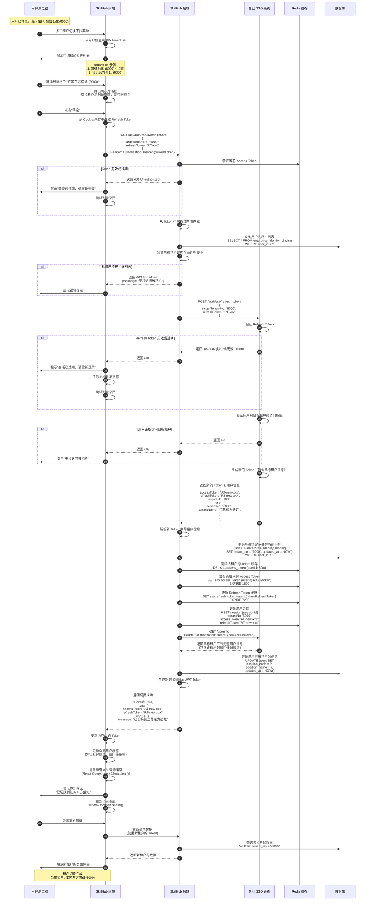

# 企业 SSO 租户切换流程

## 流程图



## 租户切换机制详解

### 1. 租户列表来源

用户的租户列表在登录时从 SSO 获取：

```json
{
  "tenantList": [
    {
      "employeeId": 74,
      "empName": "张波",
      "tenantNo": "8000",
      "tenantName": "盛虹石化",
      "position": "综合副经理"
    },
    {
      "employeeId": 66,
      "empName": "用户-QGJNDWWD",
      "tenantNo": "6000",
      "tenantName": "江苏东方盛虹股份有限公司",
      "position": "部门经理"
    }
  ]
}
```

**前端展示逻辑**：

```typescript
// 租户下拉菜单组件
function TenantSwitcher() {
  const { user } = useAuth()
  const { switchTenant, isLoading } = useTenantSwitch()
  
  const currentTenant = user?.tenantNo
  const tenantList = user?.tenantList || []
  
  return (
    <Select
      value={currentTenant}
      onChange={(tenantNo) => switchTenant(tenantNo)}
      disabled={isLoading}
    >
      {tenantList.map(tenant => (
        <Option key={tenant.tenantNo} value={tenant.tenantNo}>
          {tenant.tenantName}
          {tenant.tenantNo === currentTenant && ' (当前)'}
        </Option>
      ))}
    </Select>
  )
}
```

### 2. Token 刷新策略

切换租户时，必须刷新 Token 的原因：

1. **租户隔离**: Access Token 中包含租户信息，用于后端数据隔离
2. **权限变更**: 不同租户下用户可能有不同的权限
3. **审计追踪**: 新 Token 记录租户切换操作

**Token 中的租户信息**：

```json
{
  "userId": 123,
  "username": "zhangbo",
  "tenantNo": "6000",  // 当前租户
  "employeeId": 66,    // 该租户下的员工 ID
  "iat": 1680000000,
  "exp": 1680001800
}
```

### 3. 数据隔离机制

#### 后端数据查询

所有数据查询都带租户过滤：

```java
@RestController
public class DataController {
    
    @GetMapping("/api/projects")
    public List<Project> getProjects(@AuthenticationPrincipal PlatformPrincipal principal) {
        String tenantNo = principal.getTenantNo();
        // 只查询当前租户的数据
        return projectRepository.findByTenantNo(tenantNo);
    }
}
```

#### 数据库设计

所有业务表都包含租户字段：

```sql
CREATE TABLE projects (
    id BIGINT PRIMARY KEY,
    tenant_no VARCHAR(32) NOT NULL,  -- 租户号
    name VARCHAR(255),
    -- 其他字段...
    INDEX idx_tenant (tenant_no)
);
```

### 4. 缓存清除策略

切换租户后需要清除的缓存：

```typescript
// 前端缓存清除
async function switchTenant(tenantNo: string) {
  // 1. 调用切换接口
  const result = await api.switchTenant(tenantNo)
  
  // 2. 清除 React Query 缓存
  queryClient.clear()
  
  // 3. 清除本地存储（如果有）
  localStorage.removeItem('cached-data')
  
  // 4. 重置全局状态
  resetGlobalState()
  
  // 5. 刷新页面
  window.location.reload()
}
```

```java
// 后端缓存清除
public void switchTenant(String userId, String newTenantNo) {
    // 清除旧租户的数据缓存
    redisTemplate.delete("user:" + userId + ":data:*");
    
    // 清除旧租户的权限缓存
    redisTemplate.delete("user:" + userId + ":permissions");
    
    // 更新会话中的租户信息
    updateSessionTenant(userId, newTenantNo);
}
```

## 租户切换的前端实现

### useTenantSwitch Hook

```typescript
import { useMutation, useQueryClient } from '@tanstack/react-query'
import { authApi } from '@/api/client'
import type { User } from '@/api/types'

interface TenantSwitchOptions {
  onSuccess?: (user: User) => void
  onError?: (error: Error) => void
}

export function useTenantSwitch(options?: TenantSwitchOptions) {
  const queryClient = useQueryClient()
  
  const mutation = useMutation({
    mutationFn: async (targetTenantNo: string) => {
      // 获取当前的 Refresh Token
      const refreshToken = getRefreshToken()
      
      if (!refreshToken) {
        throw new Error('Refresh Token 不存在，请重新登录')
      }
      
      // 调用租户切换接口
      return authApi.switchTenant({
        targetTenantNo,
        refreshToken
      })
    },
    
    onSuccess: (data) => {
      const { accessToken, refreshToken, user } = data
      
      // 更新 Token
      setAccessToken(accessToken)
      setRefreshToken(refreshToken)
      
      // 更新用户信息
      queryClient.setQueryData<User>(['auth', 'me'], user)
      
      // 清除所有查询缓存
      queryClient.clear()
      
      // 回调
      options?.onSuccess?.(user)
      
      // 刷新页面以确保数据完全更新
      setTimeout(() => {
        window.location.reload()
      }, 500)
    },
    
    onError: (error) => {
      if (error.message.includes('401')) {
        // Token 过期，跳转登录
        redirectToLogin()
      } else if (error.message.includes('403')) {
        // 无权访问
        showError('您无权访问该租户')
      }
      
      options?.onError?.(error)
    }
  })
  
  return {
    switchTenant: mutation.mutate,
    isLoading: mutation.isPending,
    error: mutation.error
  }
}
```

### 租户选择器组件

```typescript
import { useState } from 'react'
import { Select, Modal, message } from 'antd'
import { useAuth } from '@/features/auth/use-auth'
import { useTenantSwitch } from '@/features/auth/use-tenant-switch'

export function TenantSwitcher() {
  const { user } = useAuth()
  const { switchTenant, isLoading } = useTenantSwitch({
    onSuccess: (newUser) => {
      message.success(`已切换到 ${newUser.tenantName}`)
    },
    onError: (error) => {
      message.error(error.message)
    }
  })
  
  const [confirmVisible, setConfirmVisible] = useState(false)
  const [targetTenant, setTargetTenant] = useState<string>()
  
  const handleTenantChange = (tenantNo: string) => {
    if (tenantNo === user?.tenantNo) {
      return // 当前租户，不切换
    }
    
    setTargetTenant(tenantNo)
    setConfirmVisible(true)
  }
  
  const handleConfirm = () => {
    if (targetTenant) {
      switchTenant(targetTenant)
      setConfirmVisible(false)
    }
  }
  
  const currentTenant = user?.tenantNo
  const tenantList = user?.tenantList || []
  
  if (tenantList.length <= 1) {
    // 只有一个租户，不显示切换器
    return null
  }
  
  return (
    <>
      <Select
        value={currentTenant}
        onChange={handleTenantChange}
        loading={isLoading}
        style={{ width: 200 }}
        placeholder="选择租户"
      >
        {tenantList.map(tenant => (
          <Select.Option key={tenant.tenantNo} value={tenant.tenantNo}>
            {tenant.tenantName}
            {tenant.tenantNo === currentTenant && ' ✓'}
          </Select.Option>
        ))}
      </Select>
      
      <Modal
        title="确认切换租户"
        open={confirmVisible}
        onOk={handleConfirm}
        onCancel={() => setConfirmVisible(false)}
        okText="确定"
        cancelText="取消"
      >
        <p>切换租户将刷新页面，未保存的数据可能会丢失。</p>
        <p>是否继续切换？</p>
      </Modal>
    </>
  )
}
```

## 后端实现

### SsoController - 租户切换接口

```java
@RestController
@RequestMapping("/api/auth/sso")
public class SsoController {
    
    @Autowired
    private EnterpriseSsoClient ssoClient;
    
    @Autowired
    private IdentityBindingService identityBindingService;
    
    @Autowired
    private RedisTemplate<String, Object> redisTemplate;
    
    @PostMapping("/switch-tenant")
    public ResponseEntity<SwitchTenantResponse> switchTenant(
            @RequestBody SwitchTenantRequest request,
            @AuthenticationPrincipal PlatformPrincipal principal) {
        
        String userId = principal.getUserId();
        String targetTenantNo = request.getTargetTenantNo();
        String refreshToken = request.getRefreshToken();
        
        // 1. 验证用户是否有权访问目标租户
        List<String> allowedTenants = identityBindingService.getAllowedTenants(userId);
        if (!allowedTenants.contains(targetTenantNo)) {
            throw new AccessDeniedException("无权访问该租户");
        }
        
        // 2. 调用 SSO 刷新 Token
        SsoTokenResponse tokenResponse = ssoClient.refreshToken(
            targetTenantNo, 
            refreshToken
        );
        
        // 3. 更新身份绑定记录
        identityBindingService.updateCurrentTenant(userId, targetTenantNo);
        
        // 4. 清除旧租户缓存
        clearTenantCache(userId);
        
        // 5. 缓存新 Token
        cacheTokens(userId, targetTenantNo, tokenResponse);
        
        // 6. 获取目标租户的用户信息
        User user = ssoClient.getUserInfo(tokenResponse.getAccessToken());
        
        // 7. 更新用户信息
        identityBindingService.updateUserInfo(userId, user);
        
        // 8. 返回结果
        return ResponseEntity.ok(SwitchTenantResponse.builder()
            .accessToken(tokenResponse.getAccessToken())
            .refreshToken(tokenResponse.getRefreshToken())
            .expiresIn(tokenResponse.getExpiresIn())
            .user(user)
            .build());
    }
    
    private void clearTenantCache(String userId) {
        // 清除数据缓存
        redisTemplate.delete("user:" + userId + ":*");
        
        // 清除权限缓存
        redisTemplate.delete("permissions:" + userId);
    }
    
    private void cacheTokens(String userId, String tenantNo, SsoTokenResponse tokens) {
        // 缓存 Access Token
        String accessTokenKey = String.format("sso:access_token:%s:%s", userId, tenantNo);
        redisTemplate.opsForValue().set(
            accessTokenKey, 
            tokens.getAccessToken(),
            tokens.getExpiresIn(), 
            TimeUnit.SECONDS
        );
        
        // 缓存 Refresh Token
        String refreshTokenKey = String.format("sso:refresh_token:%s", userId);
        redisTemplate.opsForValue().set(
            refreshTokenKey,
            tokens.getRefreshToken(),
            tokens.getRefreshExpiresIn(),
            TimeUnit.SECONDS
        );
    }
}
```

## 安全考虑

### 1. 权限验证

严格验证用户对目标租户的访问权限：

```java
public boolean hasAccessToTenant(String userId, String tenantNo) {
    // 查询用户的租户列表
    List<TenantInfo> tenants = identityBindingRepository
        .findTenantsByUserId(userId);
    
    // 检查目标租户是否在列表中
    return tenants.stream()
        .anyMatch(t -> t.getTenantNo().equals(tenantNo));
}
```

### 2. 审计日志

记录所有租户切换操作：

```java
@Aspect
public class TenantSwitchAudit {
    
    @AfterReturning("execution(* switchTenant(..))")
    public void auditTenantSwitch(JoinPoint joinPoint) {
        SwitchTenantRequest request = (SwitchTenantRequest) joinPoint.getArgs()[0];
        PlatformPrincipal principal = (PlatformPrincipal) joinPoint.getArgs()[1];
        
        auditLog.info("用户 {} 从租户 {} 切换到租户 {}",
            principal.getUserId(),
            principal.getTenantNo(),
            request.getTargetTenantNo()
        );
    }
}
```

### 3. 频率限制

防止恶意频繁切换：

```java
public void switchTenant(...) {
    String rateLimitKey = "tenant:switch:limit:" + userId;
    Long count = redisTemplate.opsForValue().increment(rateLimitKey);
    
    if (count == 1) {
        // 首次设置过期时间
        redisTemplate.expire(rateLimitKey, 1, TimeUnit.MINUTES);
    }
    
    if (count > 10) {
        throw new RateLimitException("切换过于频繁，请稍后再试");
    }
    
    // ... 正常切换逻辑
}
```

## 测试用例

### 正常流程测试

- [x] 切换到有权限的租户成功
- [x] 数据正确隔离
- [x] Token 正确刷新
- [x] 用户信息正确更新
- [x] 缓存正确清除

### 异常流程测试

- [x] 切换到无权限租户被拒绝
- [x] Refresh Token 过期跳转登录
- [x] 频繁切换触发限流
- [x] SSO 系统不可用
- [x] 并发切换处理

### 性能测试

- [x] 100 用户同时切换租户
- [x] 切换后首页加载速度
- [x] 缓存清除性能影响

---

**相关文档**:
- [企业 SSO 登录接入方案设计](./企业SSO登录接入方案设计.md)
- [企业 SSO 首次登录流程](./企业SSO首次登录流程.md)
- [企业 SSO 常规登录流程](./企业SSO常规登录流程.md)
