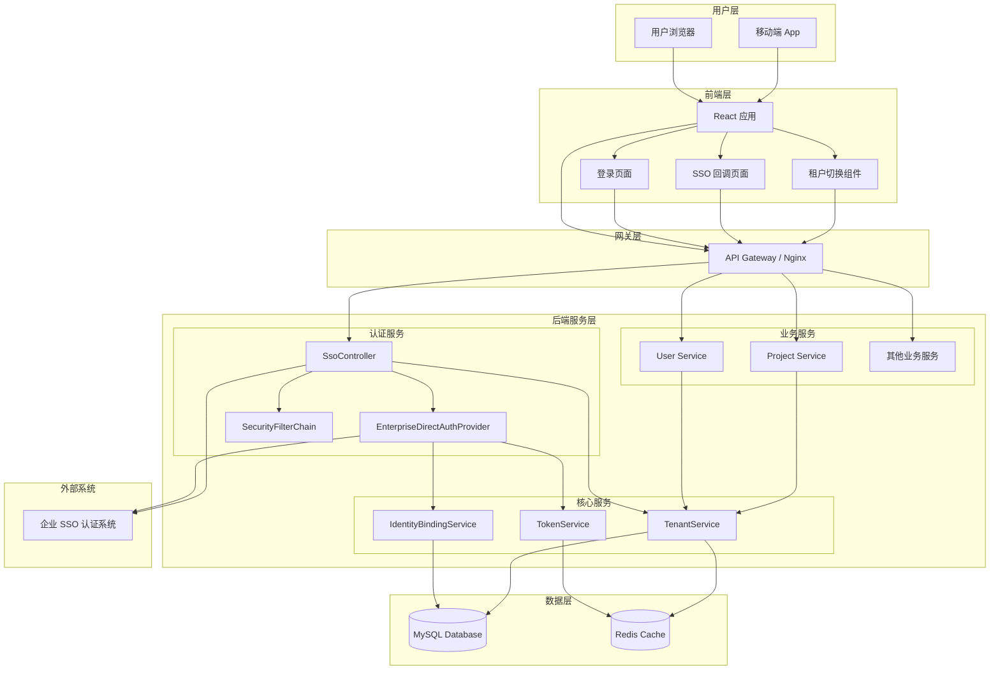
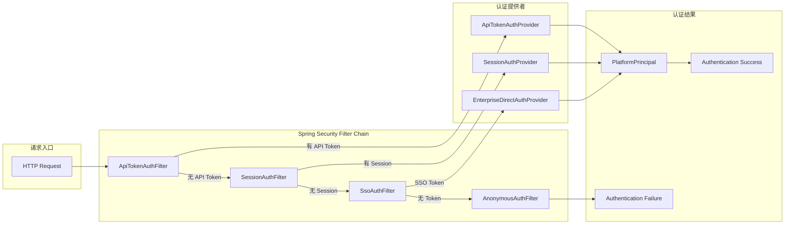
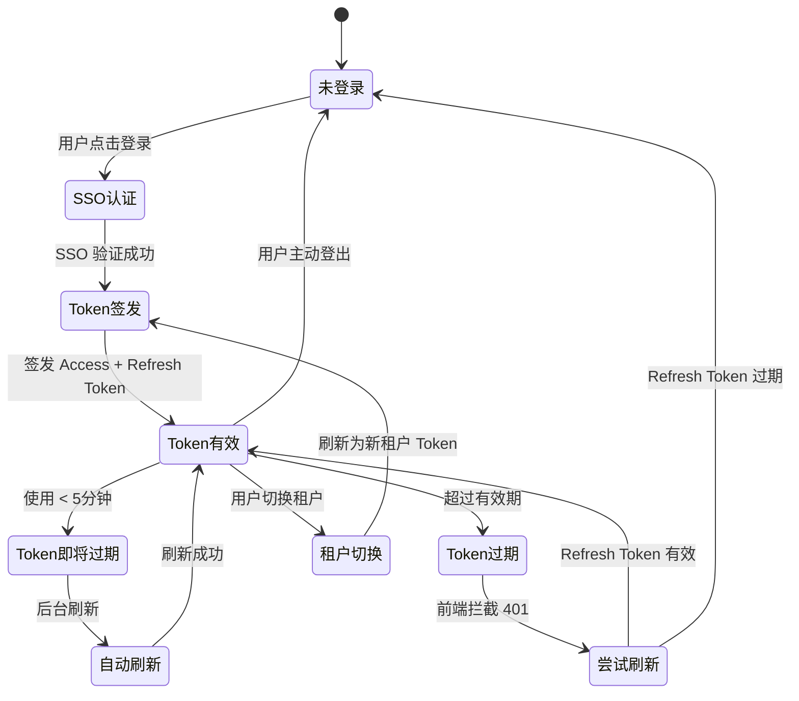
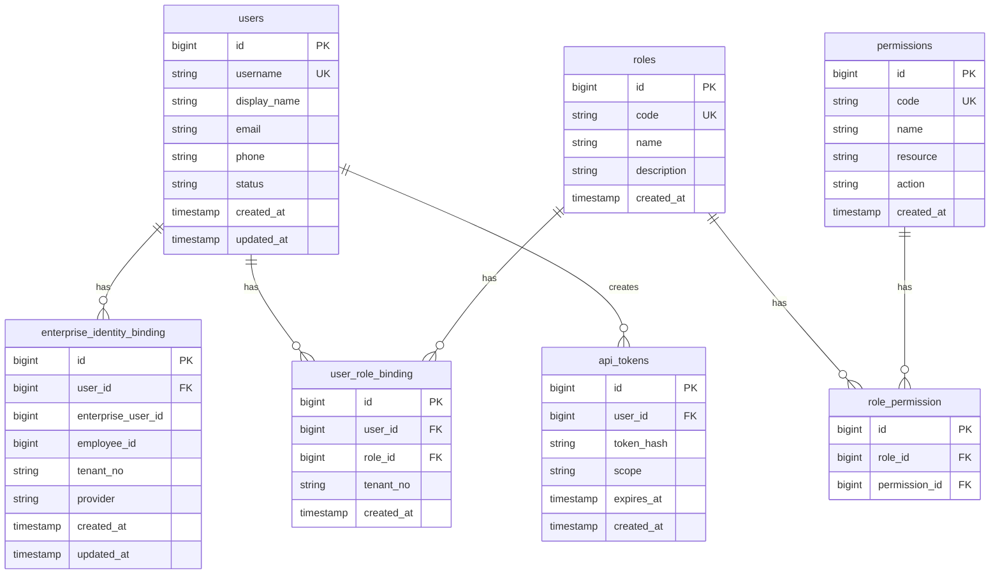
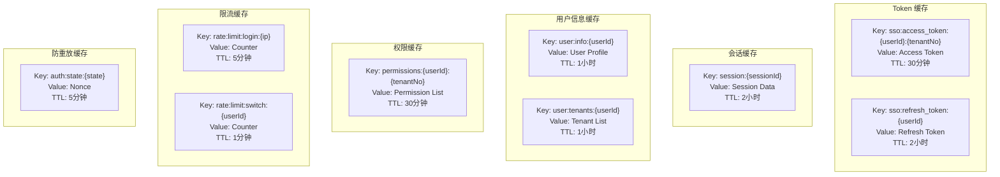
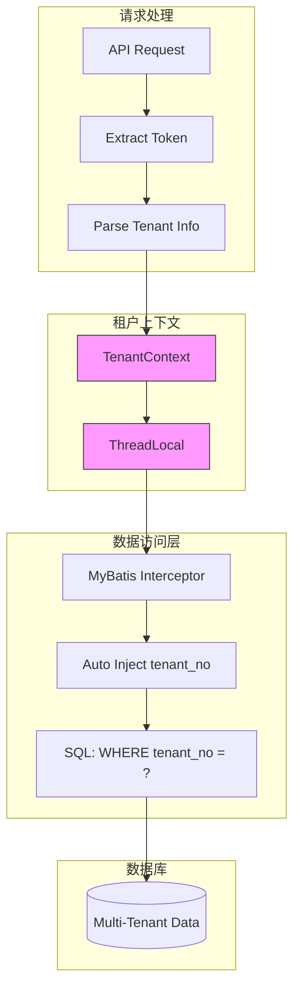
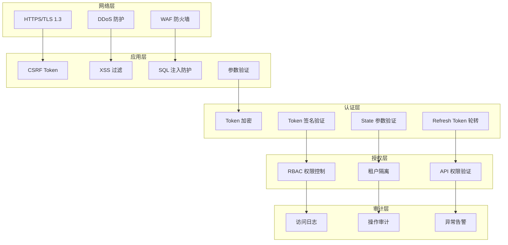
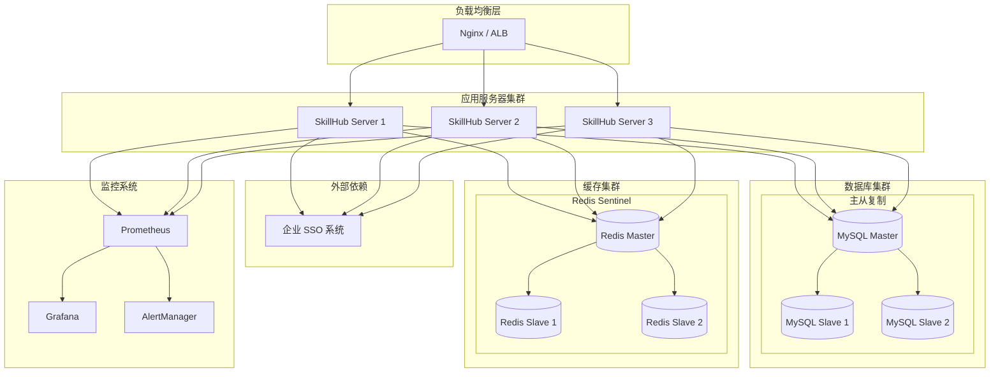

# 企业 SSO 系统架构图

## 总体架构



## 认证流程架构



## Token 生命周期管理



## 数据库设计



## Redis 缓存架构



## 多租户数据隔离



## 安全防护层次



## 部署架构



## 关键组件说明

### 1. EnterpriseDirectAuthProvider

**职责**:
- 实现 `DirectAuthProvider` 接口
- 对接企业 SSO 认证 API
- Token 获取与验证
- 用户信息映射

**核心方法**:

```java
public interface DirectAuthProvider {
    String providerCode();
    PlatformPrincipal authenticate(DirectAuthRequest request);
}

@Service
public class EnterpriseDirectAuthProvider implements DirectAuthProvider {
    
    @Override
    public String providerCode() {
        return "enterprise-sso";
    }
    
    @Override
    public PlatformPrincipal authenticate(DirectAuthRequest request) {
        // 1. 调用 SSO 登录 API
        // 2. 获取用户信息
        // 3. 绑定或创建平台账号
        // 4. 返回 PlatformPrincipal
    }
}
```

### 2. IdentityBindingService

**职责**:
- 企业账号与平台账号的绑定关系管理
- 用户信息同步
- 租户信息管理

**核心方法**:

```java
@Service
public class IdentityBindingService {
    
    // 绑定或创建账号
    PlatformPrincipal bindOrCreate(OAuthClaims claims, UserStatus status);
    
    // 查询允许访问的租户列表
    List<String> getAllowedTenants(String userId);
    
    // 更新当前租户
    void updateCurrentTenant(String userId, String tenantNo);
    
    // 同步用户信息
    void syncUserInfo(String userId, EnterpriseSsoUser ssoUser);
}
```

### 3. TokenService

**职责**:
- Token 缓存管理
- Token 刷新逻辑
- Token 验证

**核心方法**:

```java
@Service
public class TokenService {
    
    // 缓存 Token
    void cacheToken(String userId, String tenantNo, TokenPair tokens);
    
    // 获取 Token
    Optional<String> getAccessToken(String userId, String tenantNo);
    
    // 刷新 Token
    TokenPair refreshToken(String userId, String refreshToken);
    
    // 验证 Token
    boolean validateToken(String token);
}
```

### 4. TenantService

**职责**:
- 租户上下文管理
- 租户数据隔离
- 租户权限验证

**核心方法**:

```java
@Service
public class TenantService {
    
    // 设置当前租户上下文
    void setCurrentTenant(String tenantNo);
    
    // 获取当前租户
    String getCurrentTenant();
    
    // 验证租户访问权限
    boolean hasAccessToTenant(String userId, String tenantNo);
    
    // 清除租户上下文
    void clearTenantContext();
}
```

## 性能优化策略

### 1. 缓存策略

- **多级缓存**: 本地缓存 (Caffeine) + Redis
- **缓存预热**: 启动时预加载热点数据
- **缓存更新**: 使用 Redis Pub/Sub 同步多实例

### 2. 数据库优化

- **读写分离**: 查询走从库，写入走主库
- **连接池**: 使用 HikariCP，合理配置连接数
- **索引优化**: tenant_no、user_id 等常用字段建索引

### 3. 异步处理

- **用户信息同步**: 异步更新用户信息
- **审计日志**: 异步写入日志
- **通知发送**: 使用消息队列异步发送

### 4. 限流熔断

- **接口限流**: 使用 Guava RateLimiter 或 Sentinel
- **熔断降级**: 企业 SSO 不可用时启用降级方案
- **超时控制**: 设置合理的 HTTP 超时时间

## 监控指标

### 1. 业务指标

- 登录成功率
- 登录耗时
- Token 刷新成功率
- 租户切换成功率

### 2. 技术指标

- API 响应时间
- 数据库连接数
- Redis 命中率
- JVM 内存使用

### 3. 安全指标

- 登录失败次数
- 异常 IP 访问
- Token 泄露检测
- 权限越权尝试

---

**相关文档**:
- [企业 SSO 登录接入方案设计](./企业SSO登录接入方案设计.md)
- [企业 SSO 首次登录流程](./企业SSO首次登录流程.md)
- [企业 SSO 常规登录流程](./企业SSO常规登录流程.md)
- [企业 SSO 租户切换流程](./企业SSO租户切换流程.md)
