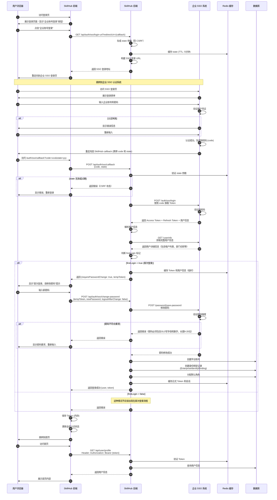

# 企业 SSO 首次登录流程

## 流程图



## 关键步骤说明

### 1. 前端跳转 SSO

- 前端调用后端接口获取 SSO 登录 URL
- 后端生成唯一的 `state` 参数用于防 CSRF 攻击
- 前端执行 `window.location.href = ssoLoginUrl` 跳转

### 2. SSO 认证

- 用户在企业 SSO 系统输入账号密码
- SSO 验证通过后生成授权码（code）
- SSO 重定向回 SkillHub 回调地址

### 3. 授权码换 Token

- SkillHub 后端接收授权码
- 验证 state 参数防止 CSRF
- 使用授权码向 SSO 换取 Access Token 和 Refresh Token

### 4. 首次登录处理

**判断依据**: `user.firstLogin === true`

**处理流程**:
1. 后端返回 `requirePasswordChange: true`
2. 前端显示修改密码表单
3. 用户输入新密码
4. 调用密码修改接口
5. SSO 验证密码强度（必须包含大小写字母和数字，8-20位）
6. 修改成功后创建平台账号并绑定
7. 返回正式 Token，完成登录

### 5. 账号绑定

创建以下绑定关系：

```sql
INSERT INTO enterprise_identity_binding (
  user_id,
  enterprise_user_id,
  employee_id,
  tenant_no,
  provider,
  created_at
) VALUES (
  123,                -- SkillHub 平台用户 ID
  74,                 -- 企业 SSO 用户 ID
  74,                 -- 员工 ID
  '8000',             -- 当前租户号
  'enterprise-sso',   -- 认证提供方
  NOW()
);
```

### 6. Token 缓存

Redis 缓存结构：

```
# 用户会话
Key: session:{userId}
Value: {
  "accessToken": "AT-xxx",
  "refreshToken": "RT-xxx",
  "tenantNo": "8000",
  "expiresAt": 1680001800
}
TTL: 1800 (30分钟)
```

## 错误处理

### 常见错误场景

| 错误码 | 场景 | 用户提示 | 处理方式 |
|--------|------|----------|----------|
| 401 | 用户不存在或密码不正确 | "账号或密码错误，请重试" | 返回登录页 |
| 403 | state 参数无效 (CSRF) | "登录链接已失效，请重新登录" | 重新获取登录 URL |
| 406 | 密码不符合强度要求 | "密码必须包含大小写字母和数字，长度8-20位" | 提示重新输入 |
| 415 | Token 缺失或无效 | "登录已过期，请重新登录" | 跳转登录页 |
| 500 | SSO 系统异常 | "系统繁忙，请稍后重试" | 提供降级方案 |

## 安全要点

1. **HTTPS Only**: 所有请求必须使用 HTTPS
2. **State 验证**: 严格验证 state 参数防止 CSRF
3. **Token 安全**: 
   - Access Token 存储在内存（不用 LocalStorage）
   - Refresh Token 存储在 HttpOnly Cookie
4. **密码强度**: 强制8-20位，必须包含大小写字母和数字
5. **Session 过期**: Access Token 30分钟过期，自动刷新
6. **日志审计**: 记录所有登录行为

## 性能优化

1. **Redis 缓存**: 缓存 Token 和用户信息，减少数据库查询
2. **并发处理**: 使用分布式锁防止重复创建账号
3. **异步处理**: 用户信息同步采用异步方式
4. **连接池**: 配置合理的 Redis 和数据库连接池

## 测试用例

### 正常流程测试

- [x] 新用户首次登录成功
- [x] 修改密码成功
- [x] 账号绑定成功
- [x] Token 缓存成功
- [x] 跳转首页成功

### 异常流程测试

- [x] SSO 登录失败（账号密码错误）
- [x] State 参数被篡改（CSRF 攻击）
- [x] 密码强度不符合要求
- [x] SSO 系统不可用（超时）
- [x] 重复创建账号（并发）

---

**相关文档**:
- [企业 SSO 登录接入方案设计](./企业SSO登录接入方案设计.md)
- [企业 SSO 常规登录流程](./企业SSO常规登录流程.md)
- [企业 SSO 租户切换流程](./企业SSO租户切换流程.md)
